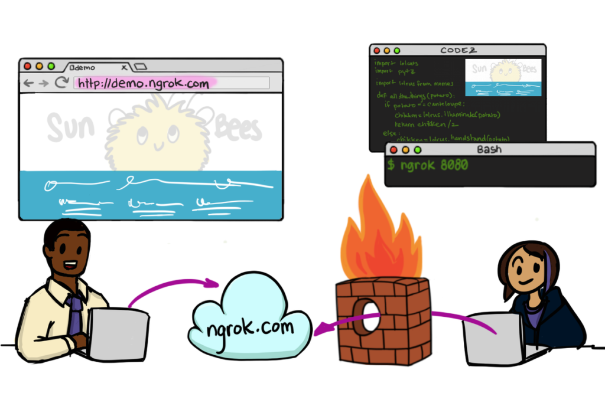

_Source: https://ngrok.com/product_

Suppose you're part of the engineering team of a tech company whose product is involves giving users product recommendation widgets for online stores. Since the product is already in the wild, so to speak, how do you test developmental features on live stores?

One way is to deploy your developmental code into the production server and temporarily expose an endpoint that is hard to guess, and test it with a testing store. This is bad for many reasons and among them are security risks, potential for crashing production with untested code, and unnecessarily polluting the production database.

Another way is to locally host both your app and the online store so that testing is done safely in the development environment of your local machine. This is almost good, but it doesn't allow you to test your code in the wild of the internet, with actual HTTP requests zooming across the wire and causing cross-origin resource sharing (CORS) errors. Also, it's not always possible to create a local version of the consumer app, especially if your client is a big-ish company. You have to hook up to their behemoth of an app, which is already live and _never_ going down.

In situations like these, we need a specialised tool.

What we want here is a tool that allows live websites to make actual HTTP requests over the internet. Meaning, it needs to make requests to a live endpoint like "https://my-saasy-app.com/api/endpoint" instead of "localhost:8000/api/endpoint", without deploying developmental code into production.

The tool I've been using at [Metisa](https://askmetisa.com) is ngrok. Using it is easier than writing [callbacks](/2021-05-18-what-is-a-callback-an-analogy-with-tea/).

```shell
# the single command to get a URL
ngrok http 8000
```

```
ngrok by @inconshreveable                                                              (Ctrl+C to quit)
                                                                                                       
Session Status                online                                                                   
Update                        update available (version 2.2.8, Ctrl-U to update)                       
Version                       2.1.18                                                                   
Region                        United States (us)                                                       
Web Interface                 http://127.0.0.1:4040                                                    
Forwarding                    http://508f6a1b.ngrok.io -> localhost:8000                               
Forwarding                    https://508f6a1b.ngrok.io -> localhost:8000                              
```

[Ngrok](https://ngrok.com/product) is essentially a web service that tunnels HTTP requests via their server through your locally installed and launched ngrok process, into your locally hosted app.

I'm always amazed at how simple it is to use. It's the hallmark of a well executed product. I just need to run `ngrok http <localhost port number>` and it provisions a URL that tunnels to that port in my localhost. As a developer, this saves me a lot of time.

Using ngrok, I can write code in the development environment on my local machine, hit Save, let `gulp` rebuild everything, and as long as I point the store to make requests to "http://508f6a1b.ngrok.io" (using the above example) instead of the production server, the store will be consuming the API hosted from my machine.

As a freemium product, there are limits imposed, like max number of connections at any time and a randomly generated URL every time you stop and start the ngrok process. But they are very reasonable limitations in my opinion. Nothing that really hinders my work at least.

If you have the need for such a tool but haven't heard of it, I hope this post has given you a rock to look under. And if you actually used it before, I'd love to hear how you have used it for your projects and learn from your experience.

* * *

### On a side note

I recently walked into a bazaar at Isetan where they were obviously running a clearance sale to purge their inventory for Christmas. Many things were on sale, but only one thing really caught my eye...

 My favourite new mug

It made me chuckle to myself. The fact that it was going for SG$3.50 made it a sweet, sweet deal. I'm still smiling to myself every time I brew a cup of coffee at work with it. Ahh, nothing beats simple pleasures.
