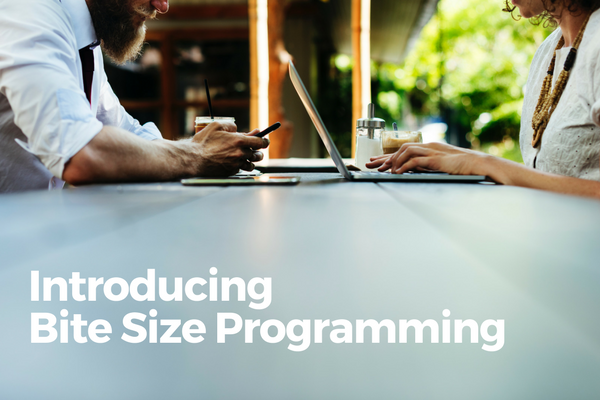

 Photo by rawpixel.com on Unsplash

I'm really excited about setting myself a new challenge, one that I think will play nice with both the daily writing challenge and my professional work as a software engineer.

I'm calling it _Bite Size Programming_. And it's going to be exactly as the name suggests - everything about programming, in bite-sized blog posts.

## Why I'm doing this

Personally, I'm doing this to try to marry two things that I care about into one - writing and programming.

I've always felt like writing about programming is an obvious thing to do, but I've never really felt comfortable doing it and so I never got around to it apart from the occasional technical post here and there.

But the work of [some](https://john.do/bad-start/) [people](https://www.youtube.com/channel/UCnePINazJJpbn9FWaq_skQA/videos) on the internet (read: strangers I don't know but stalk online) recently helped me to realise that new projects are supposed to be uncomfortable. Struggling a sure way to know that you are pushing yourself to the limits, and as a result, catalysing your growth.

These internet strangers are real people, and we just haven't had the chance to meet in person yet in this vast world we live in. But their influence on me from a distance isn't trivial. I'm sure you know what I'm talking about if you're reading this in this obscure part of the internet!

While my personal goal is to have more fun writing and programming on my blog, my real goal is something much bigger than myself.

My real goal for _Bite Size Programming_ is to invite people into the world of programming and to share my passion, knowledge, and maybe some challenges as I continue my odyssey into the centre of the tech world.

## What's it going to be?

Time to lay some ground rules for me to work with for a start.

I'm intrigued by the idea of doing short YouTube videos at some point, but I want to start with writing, which I find much more manageable. Each _Bite Size Programming_ blog post will be:

- Bite-sized in length. Less than 1,000 words, about 12 short paragraphs max
- Discussing only one topic. It's not feasible to cover more than one topic reasonably thoroughly otherwise
- Honest. I will strive to share my own stories related to the topic with you to keep things interesting and relatable

That's it! I'll also have to say that I probably won't suffocate myself with these rules if any of them make this project unbearably tedious to maintain. The goal is to execute and learn as I go along, as John Saddington (fellow blogger, programmer and tech entrepreneur and also the guy I credit with inspiring me to do this from a distance) reckons is sometimes the best way forward.

One last thing - if you're interested to follow me on this journey as I learn and fumble and share all about it, you can do so by subscribing to my mailing list. Otherwise, I'll see you here!
