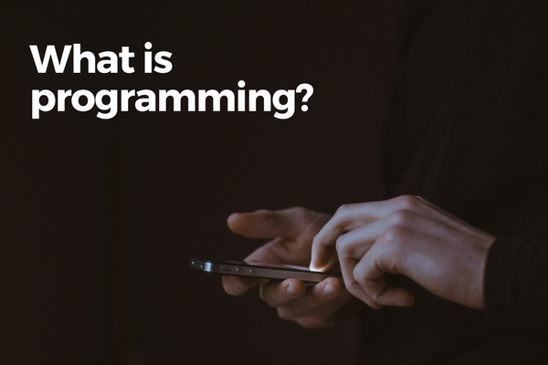

 Photo by Gilles Lambert on Unsplash

Let's begin this segment from the very top and ask, what is programming?

I think a good starting point to answering this question is to unpack the word "program."

## What is a program?

As a noun, the word refers to a predefined list of things to do chronologically, as in "this evening's program" at a concert.

In 1843, a mathematician called [Ada Lovelace](https://en.wikipedia.org/wiki/Ada_Lovelace#First_computer_program) [wrote](http://www.fourmilab.ch/babbage/sketch.html) what is now believed to be the world's first theoretical set of instructions for the [Analytical Engine](https://www.britannica.com/technology/Analytical-Engine) (the world's first computer). And when that happened, historians didn't try to be creative; they referred to her set of instructions as a computer program.

Program-ing, therefore, refers to the act of writing a computer program.

But definitions are not exactly edge of your seat kind of stuff, so let's dive deeper into what it means to write a program.

## How a program is written

If you haven't written a program before, you might be surprised to hear this:

> You can write a fully functional program in a simple text editor like TextEdit (or Notepad if you're using Windows) and nothing more.

A program is basically made up of a series of lines of text. The text used in creating the program (eg. the browser program you're running to read this) is _exactly_ the same as the text that you and I use every day on our computers.

### The prevalence of English in programming

What about programming languages? Here's a surprising fact: almost all widely used programming languages are in English.

The programming language that the web is built on, JavaScript, is written in English. You have to write JavaScript code in English.

[Python](https://www.python.org/about/), developed in the Netherlands by [Guido van Rossum](https://en.wikipedia.org/wiki/Guido_van_Rossum), is also in English. So is [Ruby](https://www.ruby-lang.org/en/about/), developed by Japanese [Yukihiro "Matz" Matsumoto](https://en.wikipedia.org/wiki/Yukihiro_Matsumoto).

JavaScript certainly looks different compared to English:

```js
// JavaScript
function print_hello_world_to_console () {
   console.log('hello world');
}
```

The above 3 lines are equivalent to us saying to the computer, "print the word 'hello world' to the console," in plain English.

But they are both trying to convey the same instruction, except to different things (one to a computer, the other to a fellow human being).

Just as our brain processes the English sentence and gives it meaning, a special program called an _interpreter_ processes the 3 lines of JavaScript code above and gives it meaning. As long as an interpreter is able to unpack the meaning of your code, it will execute what it is being told.

### Writing and programming

As you can tell by now, programming is very much like writing! The main difference is that with programming, we're writing for a computer instead of a person to understand us.

Actually, that's not completely accurate. We'll talk more about the importance of writing clean, easily comprehensible code in a later post. Also, we can't afford to leave anything open to interpretation when programming, unlike with writing, a la poetry and much of literature (although we can certainly strive to write code that would make other developers cry in awe).

So to set it straight:

> Programming is to write _instructions_ for a computer _and_ ourselves and fellow programmers to easily understand what we want a computer to do.

If you need, read that sentence again. Once you understand it, you would have understood what is programming!

Now, of course, there's still a lot of interesting aspects to programming that we haven't touched on.

Like how no sane programmer will write a program using a simple text editor like TextEdit, for example, because it would be extremely prone to errors. And how programs do not necessarily execute code from top to bottom of a file all the time like in an English essay.

But these are topics we'll discuss in posts to come. So see you in the next one!

## Summary

- A computer program is a set of instructions for a computer.
- You can write a program in a plain text editor like TextEdit or Notepad.
- Most programming languages are in English, and code is made of the same alphabets that words are.
- A special program called an interpreter unpacks the meaning of your code and executes them line by line.
- Programming is the act of writing a computer program that a computer understands but is also comprehensible by yourself and fellow programmers.
