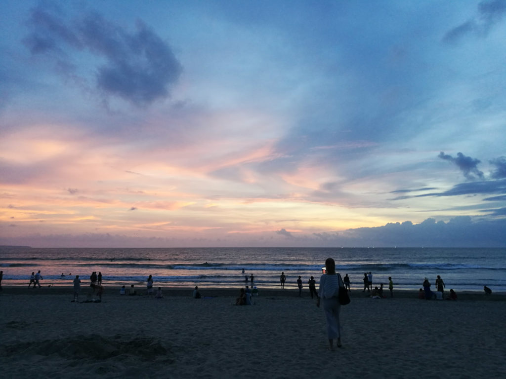
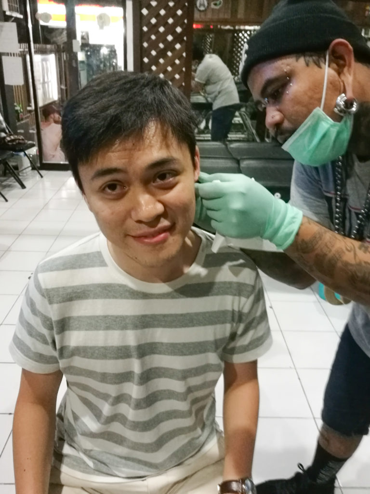

 Sunset at Kuta beach in Bali

The build-up was a full two days. And then I went and did it.

I've never thought about getting any piercings before. Always thought that I had too much of a little boy face to look good with one. (Not that I really thought about it much at all in the first place.)

 Me getting my first piercing ever from Sukliwon in Bali

But I just got one of my ears pierced this evening in Bali. I started chatting with [Sukliwon](https://www.instagram.com/sukliwon.piercing.bali/) (my piercing specialist) at 8pm at one of what must be over a hundred tattoo and piercing shops in Kuta alone. By 820pm he was done, and my left ear was adorned with a little black dot.

I'm _very_ happy with the process and how it turned out!

Today has been a beautiful day. I'm on a short vacation with my wife in Bali (our home away from home), I got a lot of writing done in the day accompanied by a great cup of coffee from Anomali Cafe, and the sunset was sublime. Now I have a chunk of black plastic hanging from my ear to remind me of it for a while.

 Enjoying a beer after getting the piercing, as if it was such a torture

Cheers to more days where we question our assumptions and cross new thresholds!
