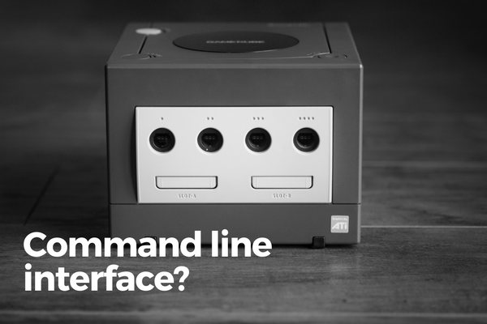

 Photo by Paweł Durczok on Unsplash

First of all, what is a Command Line Interface?

In my own words, a command line interface (CLI) is the most lightweight program that a human can use to give commands to a computer.

In the words of [Wikipedia](https://en.wikipedia.org/wiki/Command-line_interface): a CLI is a "means of interacting with a computer program where the user (or client) issues commands to the program in the form of successive lines of text (command lines)."

_Potato, potahtoe_. Basically, it is the most direct conduit to the computer (you can do _a lot_ of different things via the CLI), apart from directly modifying the source code of a program.

So do you need to download a CLI to start using it?

Nope! A default CLI comes shipped with all major operating systems. On macOS and Linux, the distributed CLI is called **Terminal**. On Windows, it is called **Command Prompt**.

### One layer on top: the Graphical User Interface

What most people are much more familiar with is the Graphical User Interface (GUI). It is like a layer of polish on top of the CLI. Though that's not entirely accurate, the exact differences are not important.

The GUI is designed to be the common person's way of interacting with the computer. The "desktop" that we immediately see when we log into our computer, for example, is part of the operating system's overall GUI.

A GUI makes a computer much more relatable and usable to a general audience (all the internet people of the world). Fun fact: the first GUI was only [developed and first shipped in the early 1970s](https://en.wikipedia.org/wiki/History_of_the_graphical_user_interface)!

While a GUI is generally easier to use, it is an amateur's tool (and I say that with no disrespect). As a programmer dealing with the inner workings of a computer, we need professional tools. The CLI is one of the most important in that repertoire.

## Reasons programmers use a command line interface

I admit it - I didn't get why programmers liked to use the command line at first either! I actually thought they just wanted to look cool and hacker-ish.

I mean, why type so much text all the time when you could easily achieve the same results with a few clicks on a beautiful GUI? Worse still, why go through the trouble of remembering so many commands?

But over the past year, I've come to really understand the beauty (indeed, the necessity) of the command line as a professional programmer. It is simple and unobtrusive - precisely the qualities that professionals in any field require of their tools.

So, let's dive in and go through the top reasons that programmers (including me) use the CLI instead of GUI.

### 1\. Concise and reliable actions

Remember when Windows "upgraded" to Windows Vista? Things shifted positions, programs were reorganised and shortcuts and other user interactions changed. Imagine having to relearn the tool you have to rely on to get work done every time there is a small update to the user interface.

With a CLI, programmers can remember a command and reliably execute the same action all the time. The CLI's user interface is always going to remain as a line of text. Business as usual, no biggie.

### 2\. Speed

Quite often, I find that I can replace 3-5 clicks with a single command.

Here's a contrived but illuminating example. To move a file two folders up from its current folder, using the GUI, we'd do the following:

1. Open current folder where the file resides
2. Open destination folder
3. Click and drag-drop the file between the folders

This is how you do the same thing on the command line:

```shell
cd /folder_name     # 1
mv file_123.txt ../../  # 2
```

The first step (# 1) **changed** our current **directory** (directory = folder) into the one that holds the file. Step 2 (# 2) **moved** the file from the current directory into the directory that is 2 levels above (`../` represents the directory above, so `../../` means two directories above).

Yes, it's tedious at the start, especially when you're unfamiliar with the plethora of commands. But operations like these are fairly common, and knowing the quickest way to make them happen can save you a lot of time in the long run.

### 3\. Automate with shell scripts

Building on the previous point about speed, another reason programmers love using the CLI is the ability to easily automate repetitive tasks.

Using the same example of moving a file two directories up, imagine that for some specific reason, you also wanted to duplicate the file after the move and rename it to something else.

Programmers can write a shell script to automate this process (and much more complex ones) by chaining a few CLI commands together.

```shell
# reorganise_folders.sh

cd /folder_name                 
mv file_123.txt ../../
cp file_123.txt ./file_123_copy.txt
```

Now to run the same series of commands again, we can just run `reorganise_folders.sh`. Smooth!

### 4\. By necessity

Sometimes programmers have to access and control a computer remotely, as is the case when we deploy code into a remote server hosted on say, [Amazon Web Services](https://aws.amazon.com/) (AWS).

To do things on the remote server directly on our own laptops, we can use something called the Secure Shell, or SSH. Programmers "SSH into" other computers all the time to make local modifications.

Here's a cool fact: about [67 percent](https://www.wired.com/2016/08/linux-took-web-now-taking-world/) of all servers run on free, open-source Unix-like operating system, of which more than half are running on Linux.

And here's another fact that makes this a big deal: macOS is a Unix-like operating system. That means that a lot of commands that we can run on a Mac computer can also be run on a Linux server. One set of commands to more or less rule them all!

### 5\. Keyboard game

If none of the above reasons are compelling enough, consider this: programmers that are obsessed with efficiency never touch the mouse!

It's perfectly possible to do 90 percent of daily programming work without using the trackpad. There's a keyboard shortcut to do just about everything. In fact, if a shortcut doesn't already exist, a programmer can create it (often times with the help of the command line).

So there you have it - five of the top reasons programmers like to use this odd contraption called the command line.

Hope this helped lift the curtains on one of the more popular mysteries of being a programmer!
