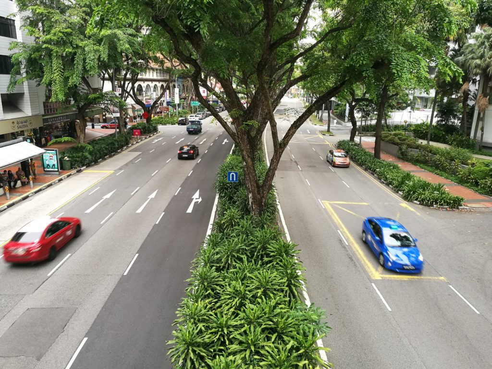

 At Beach Road in Singapore

We recently went to Bali again. It was our 6th trip there this time. I guess you could say we're a little obsessed with the place.

We really like the affordable and good food, cheap motorbike rental, friendly locals, long beach with people from all over the world vacationing in their own, differentiated ways...

There's a lot to like about the Kuta, Seminyak, Legian area of Bali. I'm also quite sure that the other places like Ubud that we haven't spent much time in yet are also desirable places to spend time unwinding from tiring city life.

Speaking of city life, I learned on this trip that I'm much less tolerant of bad conditions in Singapore than when I'm overseas. On a day when it's just as hot in Bali, for example, I'm less likely to subconsciously utter words of displeasure to myself and to people around me for becoming all sweaty and sticky. What's up with that?

The bad conditions I'm talking about include the hot weather for sure, but also little things like not having the right gear for the occasion. For example, I really dislike riding my (awesome) Shadow 400 cruiser in Singapore without my helmet visors sealed shut shielding my sensitive eyes from dryness and dirt. I'd get annoyed very quickly from having to squint while riding.

On the other hand, riding around in Kuta on a plasticky motorcycle with a rented helmet that doesn't even come with a visor somehow doesn't come up to me as an issue.

Sweat-inducing heat and dry and irritated eyes - those are just two examples of how much less tolerant I am about my environment when I'm in my home city.

Is it the sense of adventure of being overseas that keeps me constantly ready for less than ideal and even adverse conditions? Or could it be that I subconsciously have an unreasonable expectation for life to be comfortable at home?

I'm not sure, but I sure like my overseas self better - he does more and bitches less!
