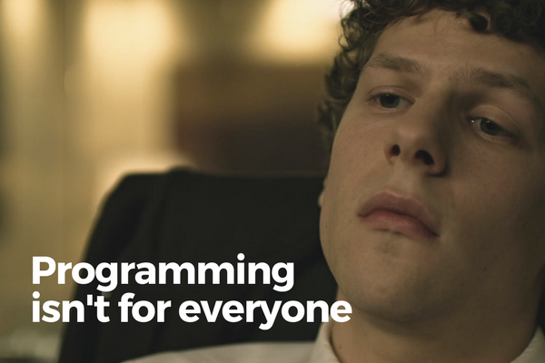

 Jesse Eisenberg in The Social Network

I recently had a few conversations with people who are not software engineers and a surprising number of these conversations veered towards my journey into programming. Many of them remarked that what I did is amazing (I don't agree), and almost all of them mentioned one thing:

> That programming is not for everyone.

Is this true?

Well, yes! Of course it's true. However, if you replaced "programming" in that statement with any other profession, they would be true too.

Perhaps some professions are _more_ "not for everyone" than others, but no profession in this world is for everyone unless you consider breathing, eating, or sleeping a profession.

I don't get angry at people who say things like that, but I do get the goosebumps, which I think might be a sign that I disapprove people who spread this idea.

To be honest, I think a person needs only a few of these fundamental qualities to be able to be a good programmer:

- Able to effectively communicate ideas, concepts, and problems to people
- Able to learn new things fast
- Able to think in a logical way
- Have empathy in order to relate to problems that you're trying to solve for the user and write readable code for colleagues
- Interest in creating small and/or large systems that deliver value to anyone who wants to use them

I think these are pretty general traits, don't you agree? Ok, maybe with the exception of the last point, but even that is not compulsory.

You can have no interest in creating systems but have a penchant for doing things in the most efficient manner every single time because you're inherently lazy, for example, and that would make you certified Good Material for Programming.

In other words, I now think that that last point should really be "having a reason."

Anyway, here are some of the qualities that I think are commonly misunderstood as being important for someone to be a good programmer:

- Being great at math
- Precocious towards programming at a young age
- Have a degree in computer science, or at least a degree in something
- Love for writing code, in and of itself
- Able to type super fast like a hacker in a Hollywood movie

Here's me hacking like a Mark Zuckerberg. Hope you'll watch till the end for the nice surprise...

https://youtu.be/Z6ebsjZLTmw

Don't listen to people who scare you out of trying to become a programmer. Try it out for a while and see for yourself. I believe that the most important quality in determining whether you'll be a good programmer is [having a reason](/2017-10-16-get-started-programming-part-1/). Things like [typing speed](/2017-10-28-type-fast-programmer/) are superfluous and don't actually matter.

If you really want to feel like a hacker before diving in, go to [this website](http://hackertyper.net/). Knock yourself out, get carried away, and hopefully realise how literally no programmer works like that. Then, start the real hacking.
