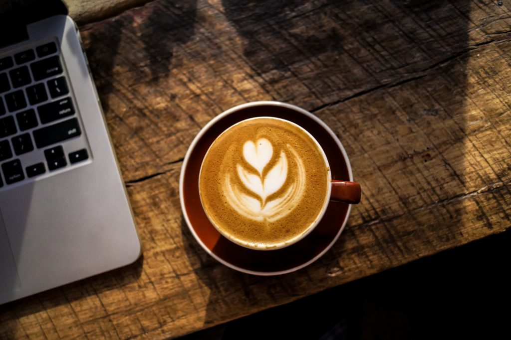

 Photo by Nolan Issac on Unsplash

I turn to coffee when I'm tired and still have some time left in the day to work. But when I brew or order that cup of coffee in a situation like that, I know I'm drinking for utility, not enjoyment.

"But you can enjoy a cup of coffee _and_ get the caffeine kick from it", I hear you say. And I fully agree with that. But I'm always able to recognise the trigger for wanting coffee, and the trigger for me to drink coffee these days is almost always sleepiness or fatigue. On days like these, coffee is just a tasty drug for boosting my energy levels (to be [paid](https://www.nickang.com/unhealthy-work/) [back](https://www.nickang.com/comparing-mindfulness-caffeine/) later).

So when I'm feeling sluggish, I _turn to_ coffee.

The reverse of this behaviour is when I'm aware that I'm brewing or ordering a cup of coffee for the enjoyment - for its flavour and the amazing air of relaxation created by its aroma.

I've come to realise that this cultivated awareness to differentiate between doing something because I need and want is quite useful. One big way in which I find it useful is in diagnosing a simple but perennially important question: am I resting enough?

Coffee and very strong tea can really be seen as fully legitimate drugs. Seen in this light, drinking coffee or tea because "I need it" is a sure sign that I haven't had enough rest and need an extra boost.

For me, I've come to realise, the litmus test for having enough rest is whether I can enjoy a cup of coffee (or tea) purely for its taste, aroma, and warmth. No strings attached, no considerations about caffeine content - just sheer drinking pleasure.

If I can, that's when I know I'm steady and well-ordered in my life. Well, at least for that day.

How about you? What indicator do you rely on to tell if you've been getting enough rest?
