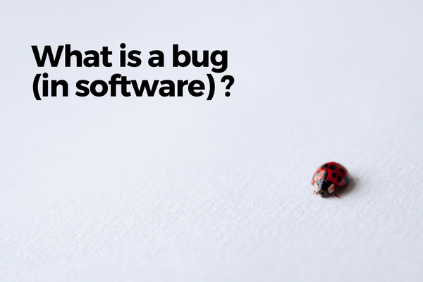

\[caption id="attachment\_1586" align="aligncenter" width="600"\] Photo by Glen Carrie on Unsplash\[/caption\]

"Crap, I think there's a bug. This isn't supposed to work like that!"

Have you heard a software engineer mention "bug" before? Well, it's inevitable, because bugs are everywhere in software...

But what exactly are we referring to when we say that "there's a bug" in a piece of software?

Put in plain English, a bug is **whatever is causing an unintended and unwanted behaviour in software**.

The origin of the word is not something most software engineers know because, well, to put it as succinctly as I can - it doesn't matter.

What matters is that we like to use the term "bug" to refer to the thing we need to _squash_ and kill (or, if you prefer less masculine terms as I do, to fix or resolve).

Bugs are our enemy. They are one of the things that most consistently stand between us and software that works perfectly in every situation every time. [User nirvana](https://www.nickang.com/bug-free-software/). But why do bugs exist, you ask?

## Why do bugs exist?

To ask this question is to really be asking, "why would software not work perfectly every time and in every situation?" Here is a list of reasons I've come to realise through my work so far:

1. There are some **edge cases** that are obscure and very difficult to foresee will happen until they actually happen
2. Any software, during the development process, is constantly starting from a **state of error** (ie. it takes time for a program to work exactly the way a developer intended)
3. **Tests**, which are supposed to be automatically run to check the software is working as intended, are not written or not run before deploying live
4. Code for implementing new features must **interact** with existing code, which can cause previously stable features to become unstable (ie. they used to work as intended, but not anymore because of recent additions to the code)
5. Developer may misunderstand or make the **wrong assumptions about a new feature**
6. Developer may have the **wrong idea of how a particular part of the existing code base works** and implements a new feature under this false impression (especially true for large code bases without comprehensive documentation)

### Unlike real life

In day to day life as human beings living in this world, we are governed by an all-encompassing set of physical laws. With these laws, all of the feedback that arises from someone doing something comes for free. For example, when you knock on a door, you expect that action to emit a knuckle-on-wood sound.

In software, however, for a knocking action on a door to emit a similar sound in the software (just an analogy), the programmer must explicitly write code that says "if a hand-like object interacts with our digital wooden door, play `wooden_door_knock` sound."

This can easily get overwhelming when you start to consider the innumerable possible objects that can be knocking on your proverbial door, from a frying pan to a tomato.

What happens when you leave out a possible object because you couldn't even imagine someone wanting to knock the door with a sausage?

By default, if the programmer didn't write code to **catch the error** and **handle** it, the worst case scenario is that the program will completely crash. Best case is that the program somehow continues to run, but the user finds it behaving in an unexpected way.

You know, like this software is _kinda buggy_?

* * *

_Bite Size Programming is a segment where I discuss programming one bite-sized topic at a time in plain English. My goal is to share tips, lessons, and ideas from my work as a software engineer, and through that, make programming accessible and fun for anyone who is curious about programming. Join the [mailing list](http://eepurl.com/c7xfID) to get the latest post delivered to your inbox so you can read on the go._
