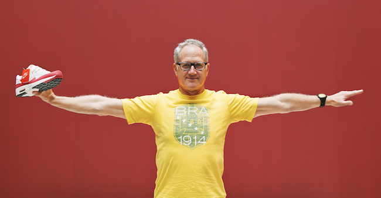

\[caption id="attachment\_1604" align="aligncenter" width="650"\] Tinker Hatfield and one of the sneakers he designed (I'd be surprised if that assumption is wrong)\[/caption\]

I recently re-started to organise what my good friend Kegan and I call "docu-nights" where we watch a documentary film together at my place. There's never an awkward obligation to sit together and engage in intellectual conversations after these films, but we often wax philosophical in areas unrelated to the film anyway.

This post is my notes from an evening spent watching [Abstract: The Art of Design](https://www.youtube.com/watch?v=DYaq2sWTWAA) season 1 episode 2 about the designs of [Tinker Hatfield](https://en.wikipedia.org/wiki/Tinker_Hatfield).

**Who is Tinker Hatfield?**

- Nike's lead designer who has his own [dedicated news section](https://news.nike.com/tinker-hatfield) on Nike's website
- Credited by Phil Knight (co-founder of Nike) for having saved Nike at a crucial time by keeping Michael Jordan interested in partnership with great shoes
- Looks like a hipster. Rides a Vespa, drives a modified Volkswagen minibus. But not really a hipster in that he has a remarkably consistent aesthetic consisting of happy, almost-pastel colours

**What are some things that helped him get good at designing shoes?**

- Knew the consequences of injury from sustaining his own major injury that thwarted him from his pole-vaulting career (but eventually led to him understanding the value of well-designed equipment)

\[caption id="attachment\_1602" align="aligncenter" width="940"\] Nike Air Jordan 20 shoes to commemorate Michael Jordan's basketball career\[/caption\]

**Lessons about design**

- Design is not art - the end goal of design should be to solve a problem for people (Hatfield explicitly said that this is how he views design and that to him, it's not ultimately about self-expression, which he sees art as)
- Good design should also be meaningful to the people involved, if possible, like the [Air Jordan 20](https://www.sneakerfiles.com/air-jordans/jordan-20/) shoes that Hatfield designed to commemorate Michael Jordan's career
- Even if a design is considered bad based on popular consensus, it can ultimately still be a triumph if it is symbolic to you as the designer (like the [Air Jordan 15](https://sneakernews.com/tag/air-jordan-15/) shoes and the tough times Hatfield was going through at the time)
- Experiencing the big world outside of the studio is important for building a library of ideas

My favourite idea from this episode has to be this:

> "If people haven't either loved or hated your work, you just haven't done all that much." (Tinker Hatfield)

This reminds me of one of my all-time favourite quotes about the [prerequisite of doing good work](https://www.nickang.com/fierce-and-original/). I think they go in a pair.
