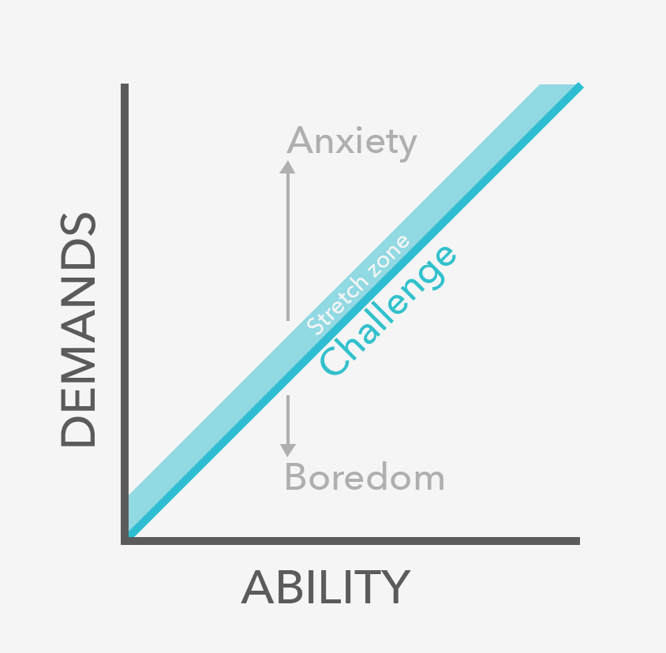
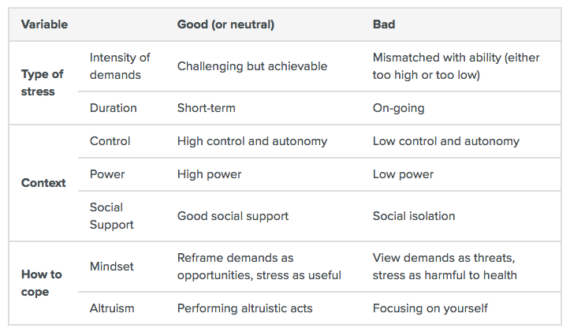

 Photo by Christopher Gower on Unsplash

Now that we're coming close to the end of 2017, I've been thinking about my career and careers in general. Having begun my career as a software engineer about a year ago, I thought it'd be timely and useful to do some reflection.

Incidentally, I had a conversation with my friend from the Army, Guan Xun, who is also a software engineer (an indie developer, creator of [WriteMapper](https://writemapper.com/)) a few days ago. He introduced me to [80000hours.org](https://80000hours.org/), mentioning that they specialise in researching and talking about careers. So I took a look. It has the highest concentration of career-related thinking and advice in any publication I've ever seen.

One of the first articles that I invested time to reading was their [article](https://80000hours.org/career-guide/job-satisfaction/) on "What makes for a dream job." I found it reinforcing many of my beliefs about careers in general.

In this post, I synthesise my thoughts and theirs into something hopefully coherent about how I think about careers.

## The 80,000 hours article

[80000hours](https://80000hours.org/) is a non-profit funded by donors (they disclose that they don't accept ad-money and corporate sponsors) and their mission is to help people in their twenties and thirties figure out how to best spend their 80,000 hours throughout their careers.

First of all, what a great cause! If they get their way, this project will have an outsized impact in the world. (Also, 80,000 hours is apparently the grand total number of hours each of us have for work before we're too old for it.

The article I read was about the elements of a "dream job." I found it be something like a mash-up between two books I've read recently: Cal Newport's [_So Good They Can't Ignore You_](https://www.goodreads.com/book/show/13525945-so-good-they-can-t-ignore-you) and Professor Adam Grant's [_Give and Take_](https://www.goodreads.com/book/show/16158498-give-and-take).

I'm going to highlight the most important points raised in the article and those two books, and weave in my own thoughts about them below.

## Work that you're good at

The first point is this: **you should tend towards doing a job that you're good at.**

This is a point that Cal Newport also made in his book. Here's an excerpt from [my notes](/2016-03-06-book-cal-newport-so-good-they-cant-ignore-you/) of the book:

> If you are good at what you do, you’re more likely to love your job. Research by Amy Wrzesniewski revealed that the type of work one does doesn’t necessarily predict whether she would enjoy it. She did this by pointing out that college administrative assistants are equally split when asked whether they see their jobs as a job, career, or a calling, and the biggest predictor for viewing such a job as a "calling" was the number of years on the job.

The positively circular logic works something like this:

Good at job --> Feel valued --> Want to get even better --> Actually getting better at job --> Even good-er at job

The power of feeling valued at our jobs is something I find a lot of people tend to overlook.

I like playing ultimate frisbee because I'm relatively good at throwing a disc. In turn, I play a lot more frisbee than I do with tennis, badminton, or any other sport. I feel good, even on the days I'm off-form.

Conversely, I have a disdain for running because regardless of how much I've tried (including pushing myself very hard for two years in the Army trying to meet their high standards), I've never really been able to run fast or for long. So even on days where I'm especially light on my feet, I'd feel like it won't last, and even if it did, I honestly think I'd still be a slow runner compared to most other men my age.

In this way, when you observe the same phenomenon happening in our careers, you realise just how important it is to feel like you're good at the job you do.

## Work that is challenging

There are two ideas that dance with each other to create magic here.

> A job that is widely perceived to be tougher than others can actually be less stressful than one perceived to be easy, because of various attributes of the job Being challenged (and rising to that challenge) can very likely lead to higher satisfaction at work and, counterintuitively, can lead to less stress

These two points culminate into one great piece of advice that I stand behind wholeheartedly: **Do not merely go for the job with the least amount of stress.**

Here's a graph that can help you wrap your head around the point about how challenge at work can ultimately lead to less stress.

 Credit to 80000hours.org

The graph depicts the sweet spot between a job's demands and your ability to do the job. You should strive to be in that sweet spot at every job.

If you're too good at the job you have, you'll get bored and easily frustrated. Maybe even plunge into (yet another) existential crisis about the meaning of your career. Stress ensues.

On the other hand, if the job is too demanding for your current experience and skill level, you'll get stressed out quickly.

But if you occupy the sweet spot at your job where your accumulated experience and skills serve you well and are being stretched just before the point of breaking, you are likely to feel more satisfied than stressed. Feeling just the right amount of challenge does wonders for your psyche and can motivate you to get even better. It also almost guarantees that you'll be in a good position at the company (otherwise, just move on to another company that values your contribution).

Of course, there are other variables that affect how you're most likely to respond to the demands of a job. But I would pay most attention to getting good (and better and better) at doing the job itself because it's an intrinsic and tangible thing that you can carry with you everywhere to any similar job.

 Credit: 80000hours.org

## Work that helps others

On to the final point of what is already a long post! I think this point ties the above points together perfectly.

Let's ask a question. What's the best way to try to ensure that you're spending your 80,000 career hours on a job that qualifies as a dream job? Here's the answer according to the article:

> Work on something that helps others.

The more you're able to feel that your job is about more than just yourself, the more meaningful the job is going to be to you.

I personally believe strongly that all of us **ultimately desire a career that is meaningful above all other outcomes** (like money, status, or recognition).

I remember once asking my mum when I was a kid about why adults work so much. My young mind was curious about what working adults were working so much for, and what they were always working on. Was there really so much work to do in the world? Aren't we ultimately doing work for one another, as in, I'm doing this for another person, and another person is doing that for me?

Even though I'm older now, I still haven't found the answer to that fundamental question. What are we all working on all the time, and who is it for?

One thing I'm growing more certain about (and I believe is a component of the answer to that question) is that we're doing the work not just for other people - we're also doing it for ourselves.

We work because we want to feel valued. It's one big way for us to feel like there's meaning in our lives.

It's important to recognise and internalise this point because even though it sounds really obvious when it is said out loud like that, our day-to-day anxieties are very effective at obscuring the real reason we go to work in the first place.

It's about meaning. At least a large part of it is.

## Other important dream job factors

These are some of the other factors that were raised in the article that I feel are useful to think about, but are not as important as the factors we've discussed above:

- Do work that you find engaging
- Having supportive colleagues who are willing to help you
- No major red flags, like long commutes ([Elon Musk](https://www.theverge.com/2017/1/25/14391410/elon-musk-tunnels-traffic-tesla-spacex-boring-company) calls it one of the most soul-destroying activities in life), extremely long work hours, unfair compensation, insecurity of job

## Parting thoughts

I'll wrap up this post with an observation about the power of getting good at something that helps others.

Remember how I mentioned at the start that my Army friend, Guan Xun, was the one who shared 80000hours with me? I also mentioned that he's a software engineer, just like I am.

However, Guan Xun is an indie app developer at this point in his career (whereas I'm [employed](http://www.altitudelabs.com)). He is a one-man show, and he recently confided in me about the struggles of having to deal with developing, marketing, and responding to customers at the same time. He's still at it though.

Now here's the interesting part - his app, WriteMapper, is the tool that I used to create a mind map of this post before I sat down to actually write it. Let's go through the list of things that make up a dream job again:

- Work that you're good at
- Work that is challenging
- Work that helps others

Is he _good at what he does_? I can testify that he is. WriteMapper is a very well designed mind mapping tool. It's smooth, the user interface gets out of the way to let you visualise ideas, and it works as advertised.

Is he finding the work _challenging_? Yes, having to wear many hats can be tough. I've been there before and I [gave up](/2016-03-12-hardware-startup-why-shelf/), because at the time, the job demanded more than I could give. I believe he's in a better position than I am, and hope he keeps going at it.

Does his work _help others_? Well, the answer to this is obvious. It's helped me with this post (and possibly future ones as well)! And he's made several sales since his launch on Product Hunt (for [Mac](https://www.producthunt.com/posts/writemapper) and [Windows](https://www.producthunt.com/posts/writemapper-for-windows)), out of which some customers must have been touched by his work.

So while it may not be apparent all the time to him (as it may not be for you and I sometimes with our own jobs), I genuinely think that Guan Xun's current job as an indie developer and entrepreneur of WriteMapper is the closest he can get to a dream job at the current stage of his career.

And this brings me to my final thought.

I believe that we should have **several dream jobs throughout our careers**. A dream career, if you want, consisting of these intermediate jobs that are the best jobs we can have at specific periods in our lives.

This line of thinking means that it is perfectly reasonable to call a job where you're learning to get good at something a "dream job" too if you're in that early phase of first getting good at something.

Finding that first dream job is hard, but I hope the ideas in this post can help you (as it has helped me) outline what it might look like and consists of.

Now, it's time to get busy getting good at something.
