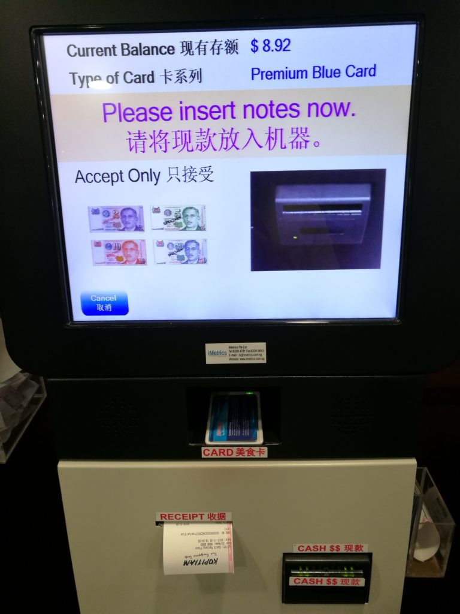

\[caption id="attachment\_1638" align="aligncenter" width="840"\] Photo by Nik Shuliahin on Unsplash\[/caption\]

Enough is enough.

We live in 2017 in a world where tech exists in every nook and cranny of our daily lives. Everyone has picked up a vocabulary of tech - gestures, button symbols, emojis (and emoji shortcuts :+1:), and so on.

Therefore it's no longer cute (or excusable on the part of the developer) in my opinion to put out poorly designed software (in) products. Sloppy software delights nobody and frustrates practically everybody. Especially developers!

So in a bid to raise the overall standard of tech, I'm going to call out organisations that put out crappy, sub-standard software into the modern world.

First up, _Kopitiam_.

## Kopitiam's top up machine

Kopitiam is the ubiquitous food court chain in Singapore. It literally means coffee shop when translated from Hokkien (a Chinese dialect).

Singaporeans love Kopitiam for its reasonable prices, good hygiene standards, and its ubiquity (it's _everywhere_). I eat at a Kopitiam at least twice a week.

They have a loyalty card that stores credit. With it, customers get 10 percent off all food and drink purchases in any Kopitiam islandwide. It's great! I can't remember whether I had to fill out a form to get the card, but if I did, these guys must be collecting a treasure trove of data about their customers every day that they can do interesting things with machine learning and targeted marketing.

But I digress.

Here's the problem I (and many, many frustrated users) have with Kopitiam - their top-up machines.

\[caption id="attachment\_1636" align="aligncenter" width="768"\] The Kopitiam top up machine with bad software\[/caption\]

You probably can't tell what's wrong just from looking at the photo. The problem lies in the way it accepts notes.

All Kopitiam card top-up machines accept only a single note at a time. Once it accepts a note, it updates your card with the new balance and the interface resets again.

But... why?

I can only think of these reasons _for_ such a design:

- the device that takes in notes has a mechanical constraint (physical space, perhaps) that prevents it from being able to hold more than one note without adding it to the deposited pile
- the owners of the establishments actually want people to use their loyalty cards _less_ - this, of course, doesn't make any sense

I think there are more believable reasons:

- the UI programmer didn't read the documentation for the hardware properly and gave up trying to make it hold more than a single note at a time
- the embedded software programmer for the hardware didn't write documentation
- the UI programmer simply couldn't be bothered
- the owners of the establishments are sneakily trying to nudge their customers to use larger notes (eg. $50 instead of $10) to circumvent the pain of having to repeatedly tap, tap, tap, tap...

One thing is for sure - the software isn't refusing to take more than one note at a time because it had trouble handling the edge case of having to refund the note. I inferred this from the fact that when a note goes in and it's recognised as legitimate cash, it goes directly to the "updating card balance" screen. In other words, once it's in, it's not coming out.

Whatever the case, I hope someone in Kopitiam makes a decision to deliver a software patch to hundreds of these machines at some point. We'd all spend a little less time (at least 5 times less) at the darn machine and more time enjoying our _kopi_.
