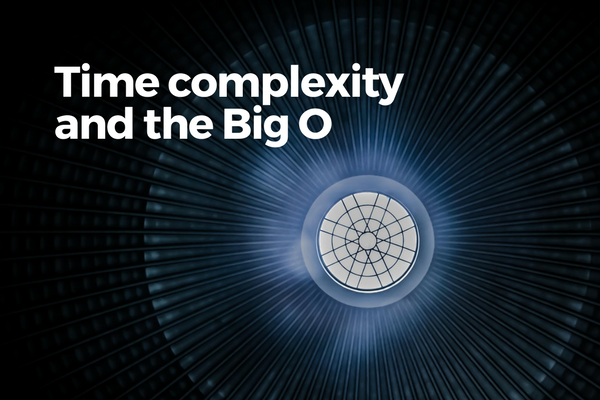

 Photo by Lysander Yuen on Unsplash

Big O notation has attained superstar status among the other concepts of math because of programmers like to use it in discussions about algorithms (and for good reason). It's a quick way to talk about algorithm time complexity.

While it’s a math concept that applies to various fields, programmers are probably one of the most frequent users of Big O. We use it as a shorthand to discuss how quickly and/or with how much memory an algorithm takes to go from start to finish.

Perhaps the part about Big O being most used by programmers is just my carpal-tunnel-visioned mind speaking, but nevertheless! It’s an important concept and here’s a post dedicated to understanding the Big O notation.

## What is Big O notation about?

Programmers use Big O notation as a shorthand to classify the general performance characteristics of an algorithm with respect to the size of the input it is given.

We use Big O in part to alleviate the problem of describing how "good" an algorithm is.

Instead of saying that algorithm A is "fast even with a very large input" or "slow even with a relatively small input," we say that algorithm A has a time complexity of O(log n) if it is fast, or O(n²) if it is kind of slow, for example.

The value within the round brackets of the `O()` is supposed to describe the **order of magnitude** in which the algorithm is fast or slow relative to the input size. That's why it's so-called "Big O." More on that in a bit.

Broadly, we can use Big O notation to encapsulate characteristics of an algorithm:

- How much _longer_ will the runtime of an algorithm become as the _size of the input_ into the algorithm increases? (**time complexity**)
- How much _additional memory_ (ie. RAM) will an algorithm need at runtime as the _size of the input_ into the algorithm increases? (**space complexity**)

For me, the mental choke point to understanding what Big O is this:

> I often _mistakenly_ think that Big O notation is a way of measuring how much time and space is needed to run an algorithm.

But this is _not_ what Big O notation is about.

Instead, Big O notation is a way of approximating how much **more** time and space is required by the algorithm **during runtime** as the **size of the input** increases from small to arbitrarily large.

> With Big O notation, we’re trying to map out an algorithm’s performance characteristics in relation to input size.

Here’s a useful graph from a very good [stackoverflow post](https://stackoverflow.com/a/487278/6463816) that shows all the practical Big O types and their general performance characteristics.

 Source: cletus on https://stackoverflow.com/a/487278/6463816

Now let’s nourish our understanding so far with a simplistic example.

var smallArray = \[1, 2, 3, 4, … , 96, 97, 98, 99, 100\];
var largeArray = \[1, 2, 3, 4, … , 9996, 9997, 9998, 9999, 10000\];

function iterate(inputArray) {
    var total = 0;

    for (var i = 0; i < inputArray.length; i++) {
        total += inputArray\[i\];
    }

    return total;
}

iterate(smallArray);
iterate(largeArray); 

If `smallArray` has 100 items in it and `largeArray` has 10,000 items, and they are passed (in two separate calls) into an algorithm that iterates through every single item in the array, this algorithm can be said to have **time complexity of O(n)**, or **linear time complexity**.

What that means is that we can expect this algorithm's runtime to increase _linearly_ with the size of the input `n`. If it helps, you can see O(n) as O(1n) because the algorithm iterates through the array of size `n` exactly one time.

This may seem intuitive, but I’m still going to state some seemingly obvious things that I tend to overlook:

- The `iterate()` algorithm's time complexity can actually be **O(1), or constant time complexity** (the holy grail of efficiency), if the input array has only 1 element
- But as programmers, we are concerned mainly with the **worst case scenario** (plan for the worst, hope for the best), therefore an algorithm like `iterate()` would be considered as O(n), or linear time complexity
- Big O describes the shape and gradient of the line on the graph (ie. the complexity), not the actual time taken to run; therefore it is really describing the _complexity_ of how time is affected by input size

### Worst case scenario

We typically consider the order of complexity of an algorithm, its Big O, as though the Murphy (and his law) has a personal vendetta against our algorithm. That is, we consider the **worst case scenario**.

But earlier we alluded to the fact that `iterate()` can actually be completed in linear time if the input array has only a single element. This is the **best case scenario**. In other words, the scenario that we should not have to fret over and can safely overlook.

Finally, sometimes programmers also consider the **expected case scenario**. That is the scenario that is most likely to play out whenever we run an algorithm. In the case of our `iterate()` algorithm, this is probably somewhere around O(n/2).

A bit more on that last point. People don't really say O(n/2). Let’s see why next.

### Constants do not matter much

What if we modify the `iterate()` function to iterate through the input array twice instead of once? What would be its new time complexity?

// modified to iterate the array twice instead of just once
function iterate(inputArray) {
    var total = 0;

    for (var i = 0; i < inputArray.length; i++) {
        total += inputArray\[i\];
    }

    for (var i = 0; i < inputArray.length; i++) {
        total += inputArray\[i\];
    }

    return total;
}

Ready?

The time complexity of the new `iterate()` function is also O(n) - the same as before!

Technically, since this algorithm iterates the same array twice, it should take twice the amount of time compared to the old single-iteration algorithm. So it would actually be more accurate to say that the new `iterate()` function has a time complexity of O(n+n) or O(2n).

But consider this: the time it takes to run an operation `n` times versus `2n` times is on the same **order of magnitude** (unlike say, `n` operations versus `n²` operations).

This is why we would still refer to this new algorithm as having O(n) time complexity - the constants do not matter much in the sense that they do not warrant us sitting up on chairs and getting worried about performance.

So in considering Big O, we drop the constants.

### Biggest time hog

The same logic that applies to constants applies to less significant parts of an algorithm. If there’s a part of the algorithm that takes up the vast majority of the run-time as its input size becomes arbitrarily large, that part determines the overall algorithm’s time complexity.

function weirdIterate(inputArray) {
    var total = 0;

    for (var i = 0; i < inputArray.length; i++) {
        total += inputArray\[i\];
    }

    for (var i = 0; i < inputArray.length; i++) {
        for (var j = 0; j < inputArray.length; j++) {
            total += inputArray\[i\] + inputArray\[j\];
        }
    }

    return total;
}

So what's the time complexity here?

If we're being precise, we would have to say O(n+n²). But as `n` gets arbitrarily large, adding `n` would become less and less significant.

Therefore for practical purposes, we should see this algorithm as having an O(n²) time complexity, dropping the lower magnitude term, `n`.

### More than one input

What happens if our algorithm takes in two inputs instead one?

Consider this algorithm that counts the number of overlapping items in two arrays.

function overlapCount(arrayA, arrayB) {
    var count = 0;
    
    for (var i = 0; i < arrayA.length; i++) {
        for (var j = 0; j < arrayB.length; j++) {
            if (arrayA\[i\] === arrayB\[j\]) {
                count += 1;
            }
        }
    }
    
    return count;
}

In this case, the time complexity is confounded by the size of two _different_ inputs instead of one.

If the algorithm iterates through the same input array twice, we should be able to identify its time complexity as O(n \* n) or O(n²), with `n` representing the size of the single input array.

But now that there are two inputs instead one, we can choose to represent them as two separate variables. Whereas it was just `n` for a single input, it would be something like `a` to represent the input size of `arrayA` and `b` to represent `arrayB` for two inputs of potentially different sizes.

Why should this be the case when we were happy to simplify `2n` as `n` in the preceding point about constants?

The reason has to do with clear representation. When we say that an algorithm has a time complexity of O(n²) instead of O(a \* b) or O(ab), we are obscuring the fact that the complexity is really dependent on two inputs rather than one. It’s just clearer.

That said, a lot of people will still refer to an algorithm like `overlapCount(a, b)` as having O(n²) time complexity. They’re not wrong because this algorithm ultimately has the same line and shape on the graph. I guess it’s a _potato, potahto_ sort of thing?

## A note about space complexity

So far we've only discussed time complexity. What about space complexity?

It's exactly the same concept, just applied to memory use (ie. RAM) instead of time.

We talk more about time complexity than space complexity. I think that's because our algorithms tend to run into runtime duration constraints than they do with reaching physical memory limits.

I know this seems like I'm skimming over a large topic in itself, and that's because I am.

I believe if we really understand time complexity, we'd gain an intuition for the space complexity of an algorithm over time as well. So I'll just leave you with that for now...

**Reference sources used in writing this article:**

- [Hacker Rank](https://www.youtube.com/watch?v=v4cd1O4zkGw) - Big O notation (video)
- [Interview Cake](https://www.interviewcake.com/article/java/big-o-notation-time-and-space-complexity) - Big O notation
- [Stackoverflow](https://stackoverflow.com/questions/487258/what-is-a-plain-english-explanation-of-big-o-notation) answer by cletus - Big O notation in plain English
