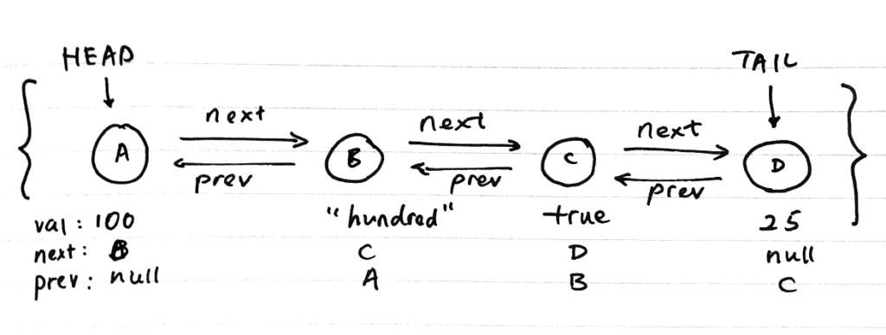

 Photo by Simon Abrams on Unsplash

A linked list is one of many commonly used data structures. The first thing to know about linked lists is that they are not the same thing as array-like primitives (eg. [`Array`](https://developer.mozilla.org/en-US/docs/Web/JavaScript/Reference/Global_Objects/Array) in JavaScript or [`List`](https://docs.python.org/3/tutorial/datastructures.html) in Python). They are similar in some ways, but they have different strengths and weaknesses.

In this post, we'll explore what a linked list is, why there's a need for it in certain situations, and its general strengths and weaknesses, especially in relation to primitive arrays that you're probably already familiar with.

## What is a linked list?

A linked list works like a primitive array in the sense that it contains a sequential series of data elements (individually called **nodes**).

There are many kinds of linked lists, but the most common are singly linked lists and doubly linked lists. The former only links forward (ie. head, next, next, next, tail) whereas the latter links both ways (ie. head, next/previous, next/previous, tail).

It's starting to sound complicated already, isn't it?

I think it's much easier to explain what a linked list is with an illustration, so here's one that I drew (which is based on an excellent [Udemy course](https://www.udemy.com/learning-data-structures-in-javascript-from-scratch/) taught by [Eric Traub](https://www.udemy.com/user/eric-traub/)):

The illustration is for a doubly linked list (because each node keeps a pointer to both the next node and previous node).

So what exactly is this "node"?

A node is just an object that contains 2 or 3 attributes: data (`value`), a pointer to `nextNode`, and optionally for a doubly linked list, another pointer to `previousNode`.

(Note that these names are just what I would call them. They are not official or anything like that.)

What about the linked list itself? Is it just comprised of many nodes?

Almost. A linked list _encapsulates_ many separate nodes but does so indirectly. Like a node, a linked list is also an object and it has just a few attributes (2 to be precise): a pointer to the `head` node and another pointer to the `tail` node.

Now take a moment to let that sink in. A linked list object only needs to keep a reference to the head and tail. The links between nodes are maintained by the node objects themselves.

We'll go through how to implement a linked list in JavaScript in [part 2](/2017-11-18-linked-list-implementation-part-2/) of this post. For now, let's continue exploring the concept of the linked list data structure.

## Why use a linked list?

The main reason programmers implement linked list instead of just using array-like primitives is that a linked list is better at doing some things than an array.

The two main advantages that a linked list has (over an array) are:

1. Flexible memory allocation
2. Speedy insertion and deletion of data elements

### Flexible memory allocation

The first useful thing about a linked list concerns memory allocation and is a feature that is typically only useful when using low-level languages like C that lets you do memory management.

This point is less applicable to a high-level language like JavaScript that does memory management automatically for us.

That said, when I first learned about this advantage of a linked list, it immediately made sense to me why people used it.

Let's use another illustration to understand this advantage.

Each of the shaded square boxes at the bottom left represent a data element in an array, and on the bottom right, data elements in a linked list.

Because nodes in a linked list explicitly point to the node on their right and left, these individual nodes can be stored in separate locations in physical memory. They would still be able to point to each other.

This means that linked lists can be broken up into multiple smaller pieces and **allocated to different non-contiguous parts of physical memory**.

This characteristic means linked lists **can grow arbitrarily large as long as there is a bit of memory left**.

An array, on the other hand, needs to be allocated contiguously (ie. in one long unbroken sequence), which means the memory allocator must find a suitable space for the array to exist in memory.

If there isn't a suitably long sequence of free memory slots, the array cannot be created in the first place!

### Speedy insertion and deletion

The second advantage of linked lists over arrays is the speed of inserting and deleting an item.

To delete a node in a linked list, we just need to carry out these few steps:

1. Change the reference of the previous node's `nextNode` to the current node's `nextNode` (or `null` if there's no next node)
2. Change the reference of the next node's `previousNode` to the current node's `previousNode` (or `null` if there's no previous node)

That's deletion. To insert a new node, the steps are the same as deletion, except the references need to be updated to point at the new node instead.

This is practically cost-free compared to what needs to happen for an array to add or delete an element.

To insert an element in the middle of an array, for example, requires re-indexing every single element that comes after this inserted element. That's an `O(n)` linear time complexity algorithm, compared to the linked list's `O(1)` constant time.

## Problems with linked lists

So those are the strengths of a linked list. Now let's turn our eyes to scrutinise its weaknesses.

When it comes to _finding the desired position_ to insert or delete a data element, a linked list is outperformed by an array.

This operation is called random access. For an array, random access is possible and is a constant time (`O(1)`) operation because every data element is indexed.

With a linked list, **random access is not possible**. Finding the desired node would be a linear time operation (`O(n)`) because you would need to traverse one node after another until you arrive at the right node.

This is the case because linked lists work via links between each node and neither the nodes nor the linked list itself stores an index for every element.

(It's possible to index elements in a linked list but that would actually defeat the purpose of having a linked list in the first place since it would mean that elements would have to be re-indexed after every insert/delete operation, which is the weakness that comes with random access that conventional arrays have!)

So that's it! That was a quick lowdown on what linked lists are, why it exists, and some of its strengths and weaknesses.

To learn how to implement a linked list in JavaScript, head over to [part 2 of this post](/2017-11-18-linked-list-implementation-part-2/).

**References and additional resources:**

- My [post](/2017-11-15-algorithm-time-complexity-big-o-notation/) on Big O notation and time complexity
- [Wikipedia](https://en.wikipedia.org/wiki/Linked_list) article on linked lists
- Udemy [course](https://www.udemy.com/learning-data-structures-in-javascript-from-scratch/) by Eric Traub: Learning Data Structures in JavaScript from Scratch. I highly recommend this course - the instructor is concise and covers many data structures, including linked lists
