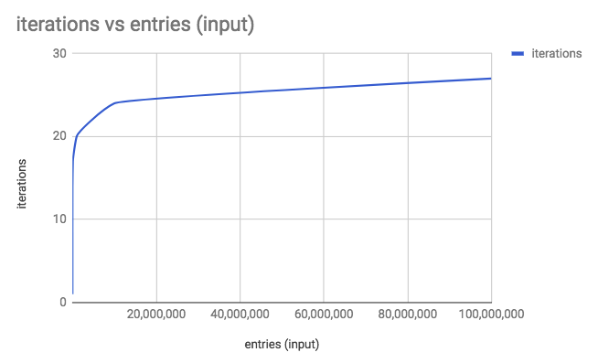

 Photo by Pablo Garcia Saldaña on Unsplash

If you're a software engineer, you've probably heard about binary search before. And if you don't know what it is, how it's implemented, and its strengths and weaknesses, this post is for you.

Binary search is, as its name suggests, a _search_ algorithm. In fact, it's one of the most efficient and commonly used search algorithms.

You can use binary search to _very_ quickly narrow down on an entry in a very long list of entries. Like in a phone book. (In case you're lucky to be really young in 2017 and don't know what a phone book is, it's a thick dictionary-like book that contains people's phone numbers and next to their names. Oh, and they're usually yellow.)

## Phone book exercise

Let's do an exercise before talking about implementing binary search in code.

You live in the 1990s and having seen the rise of Internet companies, your particularly far sighted mind recognises that this would be one of the last moments in history that you can truly experience what it's like to flip through the Yellow Pages and look for someone.

Which is perfect timing, because you were thinking of rekindling your friendship with a guy you knew from primary school called Steve anyway. Steve was remarkably precocious with computers. And you're thinking of starting a company and grabbing some investors' money to fund it. It would be like the Yellow Pages, except published on the Internet. _That_ would be so _fresh_.

So you go to your mum's room to retrieve your family copy of the Yellow Pages. There you have it, in front of you on the dining table. _"Let's find you, Steve. We'll do amazing things together!"_, you mutter in your own head as if he could have heard you.

ABCDEFGHIJKLMNOPQRSTUVWXYZ

ABCDEFGHIJKLMNOPQR **S** TUVWXYZ

And so you begin searching the phone book. In this particular version, names are sorted alphabetically starting with people's first name then middle name then last name.

In your mind, 'S' is somewhere I'm the middle of the alphabets, so you split the book more or less exactly in half and check what the first names started with.

You see 'I,' which startles you a little, but you shrug it off. _There must be a lot of Adams and Bobs in this country,_ pushing the middle alphabet off center to the right, you reasoned.

At this point, since you know that all the names on the left of this page will start with a letter that is before 'I' in the alphabetical system, **you make an intuitive decision to only continue searching to the right side of the book**. Everything on the left is irrelevant to your quest to become the next dot com millionaire.

With the book split into the second half, you half the second half to get to the mid point. This time you see that the first name on the page is "Peter," and you know you're getting close.

'P' is just _before_ the alphabet 'S,' so you once again make the intuitive decision to ignore the first half of the book, and you repeat the same action with the remaining second half.

You do this 2 more times and you finally arrive at a page where the names begin with the letter 'I.' Then, one more repetition of this "open mid point, discard one half and open the new mid point" searching strategy, which is as eloquently as you can put it subconsciously in your mind, and you found it - "Steve Wozniak." Your old friend, found!

## Binary search

You probably already realised from the beginning that we're talking about how binary search works.

The beautiful thing about this algorithm is that it can locate a specific entry in a sorted list extremely efficiently. Just how efficient is extremely efficient?

Well, it takes only 10 iterations to find an entry among 1,000 entries, 17 iterations for 100,000 entries, and 20 for 1,000,000 entries.

Plotted on a graph with number of operations on the y-axis and input size (total number of entries in the phonebook) on the x-axis, the time complexity of binary search looks like this:

 The amazing time complexity of binary search (O(log n))

In other words, the binary search algorithm takes **logarithmically less time to execute as the input size grows**. So, in terms of [Big O notation](/2017-11-15-algorithm-time-complexity-big-o-notation/), binary search is said to be a **O(log n) time** algorithm.

### The problem with binary search

While binary search is a beautiful algorithm that is both relatively easy to implement and incredibly efficient at searching for an entry in any arbitrarily large number of entries, it has one important caveat: **it only works on a sorted input**.

This implicit criterion for binary search to work is important, because sorting an array (or list in Python) is typically a poly-logarithmic time algorithm in itself, or O(n log n) time complexity.

What this means is if your input array at the beginning is not yet sorted, it first needs to be put through a sorting algorithm.

Of all the well-known sorting algorithms, the best time complexity (in the worst case scenario for each) is poly-logarithmic, or O(n log n). That is roughly two steps up from the O(log n) of the binary search. Merge sort, for example, has O(n log n) time complexity.

Ok, so we've gone through the main reasons to use binary search and its main caveat. Now let's look at the implementation in JavaScript.

### Implementing binary search

Note that because the code for binary search is quite self-explanatory, I'll not be explaining it step-wise.

If you find it hard to understand, I highly recommend you take a piece of paper and write out exactly what happens step-by-step when you invoke `BinarySearch(array, searchValue)`. I find that to be the best way to really understand any implementation!

function binarySearch(array, key) {
    var lower = 0;
    var upper = array.length - 1;
    var mid;
    var currentItem;
    
    while (lower <= upper) {
        mid = Math.floor((lower + upper) / 2, 10);
        currentItem = array\[mid\];
        
        if (currentItem < key) {
            lower = mid + 1;
        } else if (currentItem > key) {
            upper = mid - 1;
        } else {
            return mid;
        }
    }
    return -1;
}

// test it
var input = \[0, 2, 40, 44, 48, 55, 66, 99\];
console.log(binarySearch(input, 66));  // should print 6

You can also view this on GitHub [gist](https://gist.github.com/nickangtc/4374ea5660f6bbf2b97db5c6d719009f) and star it to keep a copy for future reference.

Hope you've learned something. See you in the next post!

**Resources:**

- [Wikipedia](https://en.wikipedia.org/wiki/Binary_search_algorithm) - binary search algorithm
- [GeeksforGeeks](http://www.geeksforgeeks.org/binary-search/) - a bit more details and implementation in lower level langauges like C/C++ and Java
