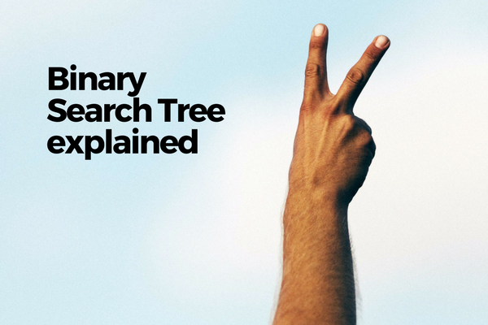
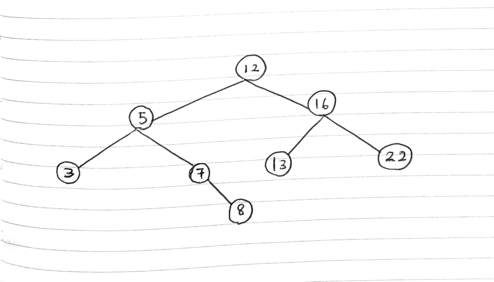
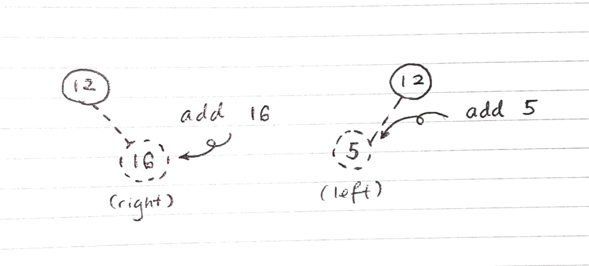
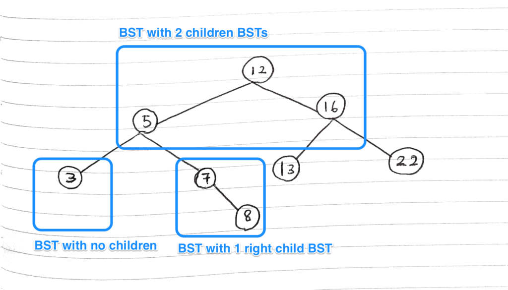

 Not my arm. Photo by Patrick Fore on Unsplash

What is a binary search tree? How is it related to binary search? Is it an algorithm or a data structure?

In this post I'll share what I've learned about binary search tree in the last week from videos, tutorials, and practice. As usual, the resources I used to learn about this data structure (you caught your first lesson already!) will be shared at the bottom of this post.

Without any further delay, let's dive in!

## What is a binary search tree?

A binary search tree is a **data structure**. That means it stores data in its own unique structure.

In a binary search tree, each data element (or data item, or data point... call it what you want) is stored in a node within a tree structure, and each node in the tree can have a maximum of 2 children nodes attached to it - one on the left, another on the right.

Here's an illustration:

 My best rendition of a Binary search tree

Each circle is a node in the overall binary search tree. As you can see, not all nodes have a parent (eg. the root node at the top) and not all nodes have children nodes (eg. every extreme last node).

How this structure is useful will become apparent in a bit. For now, let's try and understand how a new data element is added to an existing binary search tree, which should allude to the usefulness of this structure.

Ok, so how do the nodes get placed?

Let's say we have a new value to store in an existing binary search tree with a few nodes already. Every new piece of data is stored in a node, so we'll need to place a new node on the tree.

Nodes are placed in the same way binary search is carried out. That is, we start at the first node at the top and ask: is the new value (and therefore new node) that I'm trying to add **smaller or bigger** than the current node's value?

As a rule, if the new value is smaller than or equals to the current node's value, we _attempt_ to create a new node to its **left**. If it's a **bigger** value, we attempt to do the same but on the **right**.

 Smaller or equal values go left, and bigger values go right

Notice I said _attempt_. That's because each time we move to inspect a node, we'd have to check if it already has a child in the position we want to create a node at.

If it already exists, we basically repeat what we did in the previous node - ask "is the new data element's value smaller or bigger than the current node's value?" and move to the left or right again.

Here are the rules laid out in bullet points:

- Every node can only have 0, 1, or 2 children nodes
- Children nodes can be added to an existing node either on the left or right position
- If a new data element's value is **smaller or equal** than the current node, we check if the current node has a **left** child - if not, we create a new node and place our new data element there
- If a new data element's value is **bigger** than the current node, we check if the current node has a **right** child - if not, we create a new node and place our new data element there
- Or else if a child node exists in the position we checked, we repeat the previous 2 steps until we find a node with no left or right child, and create a new node there with the data element

So that's how a new data element is added to a binary search tree.

Now on to a small technical qualifier - what I've just said it is not completely accurate. Each "node" would actually be more accurately seen as a separate binary search tree in itself.

 Each "node" in a binary search tree is actually another binary search tree

So each "node" is a binary search tree that is contained in another binary search tree. Also, in terms of implementation, each "node" is created from the same `BinarySearchTree` constructor function as the original binary search tree object.

It's not a big deal in my opinion, but it's a good to know.

If you've read this far, you now know how a binary search tree is structured! But you may be asking, why is it called a binary search tree?

## How is binary search tree related to binary search?

The quick answer is this: a binary search tree implements a data structure that is based on the binary search algorithm. That's why it takes its name.

Firstly, in case you don't already know what binary search is, you can read about it in my [post](https://www.nickang.com/binary-search-explained/) on that.

As a short refresher, binary search is a remarkably efficient search algorithm that halves an input array with each iteration, keeping only the half that it knows contains the item we're searching for. It continues until it finds the item we're looking for and returns it.

Binary search (the algorithm, not the tree data structure) can do this "keep half, discard the other" implicitly because the input array is expected to be _sorted_ (eg. by names in a phonebook). If it's not sorted, the algorithm will not work correctly.

So how is this similar to a binary search tree (BST)?

In terms of searching a binary search tree, the _process is actually identical_.

Imagine that you're searching our binary search tree for a particular value, say, 8. How might you do it?

Try it with the tree you saw earlier. Literally, search for the value 8, step by step, asking the golden question "is it smaller or equals to the value or bigger?" and go left and right until you find the value. Go on, I'll wait!

Ok, so here's how we might search a value in a BST:

1. Start from the parent-most BST at the top
2. Check the value of that BST: **is the value I'm searching for less or equals to or more than the current BST?**
3. (Less than or equals to) Keep searching the left side of the current BST, discard the entire right side of the current BST, and examine the new BST
4. (More than) Keep the right side of the current BST, discard the left side of the current BST, and examine the new BST
5. Repeat until you find the value or hit the last BST with no children BSTs, and return the binary search tree or `null`\-ish value

This is _exactly_ like binary search, where we half an input list to get the entry in the mid-point, check if it's the value we're looking for and if not, discard one half and repeat the same step on the remaining half until we find the value (or find none).

In other words, a BST is a data structure that maintains a perpetually sorted tree (each time a new value is added, it is always added at the "right" place that enables quick binary search).

## Binary search tree vs binary tree

Another distinction we might want to make is that of a _binary search tree_ and a _binary tree_.

Here's the difference in a quick sentence: a binary search tree is _a type of_ binary tree. Specifically, a BST is a binary tree that maintains a strict rule that nodes on the left will always have a value that is smaller or equals to the current node, and the right always has a larger value.

For a bit more detail, I recommend reading this very [short article](http://orcunyilmaz.com/coding-c/difference-between-binary-tree-and-binary-search-tree.html).

## Wrap up

- A binary search tree (BST) is a data structure
- Each "node" in a BST is actually another BST with 0, 1, or 2 children nodes, and they have the same methods available to them as any BST
- Conceptually, it's usually easier to just refer to each point in a BST as a "node"
- Addition of a new node is based on its value in relation to the nodes in the tree, and follows a specific rule (smaller or equal values go left, and bigger values go right)
- The way search is carried out on a BST is identical to the binary search algorithm

And there you have it - the binary search tree explained! Hope you learned something from this post.

In the [next post](https://www.nickang.com/why-use-binary-search-tree/) I discuss some of the strengths and weaknesses of a binary search tree.

* * *

_For more posts like this, check out Bite Size Programming. If you want to get the most interesting posts from this blog, [subscribe](http://eepurl.com/c7xfID) and I'll send you a weekly curated list straight to your inbox. It's free. See you soon!_
