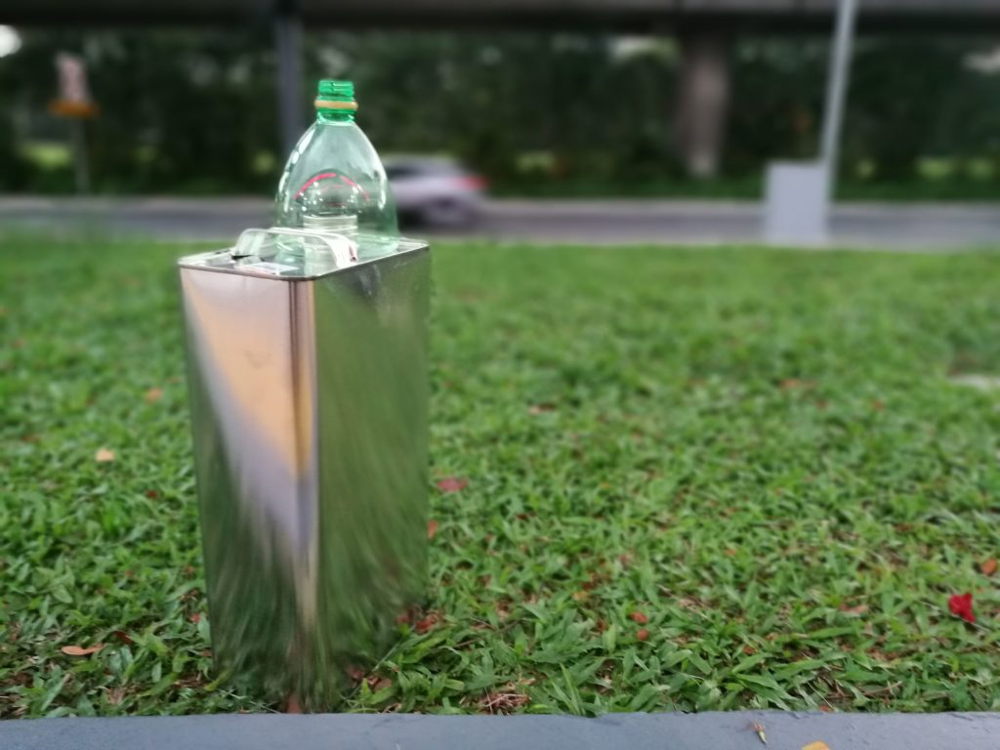
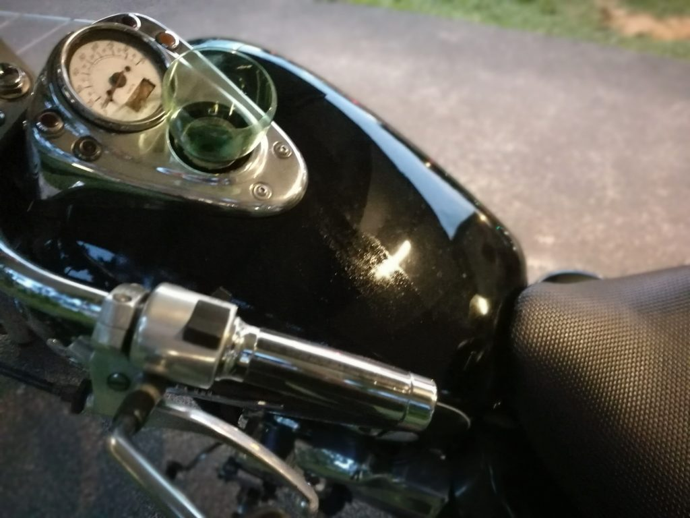

 Photo by Les Anderson

Hello, friend. If you're here for an actual guide on what to do when your bike runs out of fuel, skip ahead to the "What to do when your bike runs out of fuel" section below. I'll be recounting my own experience today first in the proceeding section.

Today after knocking off from work, I hopped on my Honda Shadow 400 and rode away from the office. I was ready to go home to my wife and dog after a long day at work.

Three minutes into the 30 minutes journey though, I noticed my engine getting softer... and I immediately knew that it was running out of fuel. My eyebrows grew heavy.

I kicked the bike into neutral, turned off the ignition, got off and pushed it to the nearest sidewalk (I was amazed at my newfound strength, pushing a 225kg Shadow). This was not my first time. That happened on the expressway.

How did I get into such a situation in the first place? Three words: no fuel gauge. Some old bikes, like my 20-year-old Shadow, do not ship with a fuel gauge. Nuff said.

Even though this wasn't my first experience depleting my fuel tank, I found myself surprisingly composed throughout the entire incident. In the end, I spent an extra 50 minutes and about $25 to remedy the situation, and all was well again.

In case you haven't been in a situation like this before, I'll share the way I deal with it. It's actually a fairly simple problem, so don't stress out.

## What to do when your bike runs out of fuel

Here's a step by step guide on how to deal with the out-of-fuel situation. This applies to motorcycles as they do to cars.

### 1\. Indulge in a little self-loathing for letting this happen

It's kind of your fault. Though you know it's not entirely your fault, you'll undoubtedly feel like punching yourself. So maybe do it (figuratively, I hope).

Over it? Great! Now let's get to work to remedy the actual problem. :)

### 2\. Move your bike (and yourself) out of danger

Last thing you want is for fuel to be the smallest problem. To keep that as the only problem, push your bike off the road if you can, or as close to the curb as possible.

### 3\. Lock up, take your phone and wallet

**Make sure you have your identity card with you** because you'll be purchasing petrol in a tin can from the petrol station - the attendant will need to make a record of your silliness (and to ensure you're traceable should you decide to set something on fire).

### 4\. Check Maps and Uber to the nearest petrol station

**Go to the nearest petrol station** and purchase a few litres of petrol. In Singapore, they sell 5L empty tin cans for $3.70. Petrol sold separately.

### 5\. Ask for a funnel

As you pay the attendant for the tin can, ask nicely whether they have a funnel they could spare.

Pouring fuel into a motorcycle or car without a funnel is like trying to drink water without touching the lip of a bottle and without tilting your head backwards. You'll transfer 5% of the contents and create a mess with the remaining 95%.

 A 5L can of petrol and a homemade funnel from the attendant

If the folks at the petrol station don't have a handmade funnel to spare, consider making one yourself. Buy a 1L plastic bottle of water, drink up, and borrow scissors to cut out its upper half. Voila, a hand-crafted funnel!

### 6\. Uber back to your bike

Self-explanatory.

Try not to spill fuel in your driver's car. And prepare to explain why you're carrying a tub of flammable liquid with you.

### 7\. Pour petrol into vehicle

This step is much easier for a bike than a car because the inlet to the fuel tank of many bikes faces the sky. Free gravity assist.

 Get ready, things may get a bit messy even with a funnel

### 8\. Top up to full

Once you're done transferring the 5L of fuel into your vehicle, consider driving to the nearby petrol station (possibly the one you just came back from) to refuel till your tank is full.

I'd do this for peace of mind because I can never know the transfer efficacy I achieved. It'd be tragically hilarious to have this happen twice in one evening.

As a gauge, 5L of petrol should be enough to propel any motorcycle for at least 60 to 80km (about 50 miles).

And that should mark the end of your mini ordeal.

Hope you enjoy the rest of your commute - ride safe!
