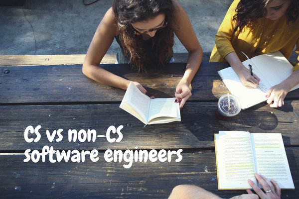

 Photo by Alexis Brown on Unsplash

From what I can tell so far, software engineers who didn't graduate from a Computer Science (CS) degree program quite often have an inferiority complex.

Based on my year of working closely with many CS graduates at my current job, and with a little bit of self-confidence, I can assure you that most of our fears are unfounded.

That said, there is one crucial difference between "them" and "us": **they have already put in the hard work of cracking their skulls trying to understand a lot of famous and often-used algorithms and data structures**, whereas we only have a smattering of experiences from learning on our own and on the job.

(Quotation marks are used to signify the false and artificial division between CS and non-CS engineers.)

This is not a trivial difference. It's actually an important one, and likely the only real big difference between CS and non-CS software engineers.

You've probably heard stories of precocious young adults tinkering with gadgets when they were very young who eventually became geniuses that helped build successful companies like Microsoft (Bill Gates) and Apple (Steve Wozniak). I think this situation is a bit like that.

CS graduates would have had 3-4 years in the wonderful learning environment of the university to grasp many CS concepts, some of them kind of useless and overly theoretical, but some actually useful.

Having invested significant time in understanding algorithms and data structures, out of genuine interest or necessity to pass exams, CS graduates should naturally be ahead of non-CS engineers in our line of workin this respect. Nothing beats deep studying and practice when it comes to understanding conceptual ideas like algorithms and data structures.

So while non-CS engineers are ahead in terms of time invested in building actual, usable applications, we should expect ourselves to be weaker in algorithms and data structures.

I recently identified them as my biggest weakness at this stage in my career (one year into being a software engineer).

To make up for "lost" time, I'll need to do my own deep study and practice so that I can be much more effective in contributing clean, scalable code to projects, and ultimately to delight users with a great product.

Hoping I'm not misguided with this thought. Now if you'll excuse me, I'm going to go crack my skull a bit.
