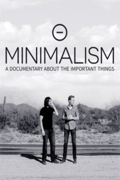

Watch the [Minimalism documentary](http://minimalismfilm.com/watch/). I watched it on Netflix.

## My notes

Some words and phrases that frame the issue of excess in modern day living: mindless consumption, crap that we don't need, "I want that".

We ought to start questioning every thing that we bring into our lives. A good question is, "Is this still something I really need? Does it bring me joy?" If the answer is neither, we have to let it go before our warped purchasing habits continue to strengthen.

Marketing over the last four to five decades has been the shaping force behind many of our warped worldviews.

Many people now have needlessly high income expectations. Reality TV, magazines, and advertising planted in us the idea that a 6-digit annual income is what we need in order to live a successful and happy life.

Homes are generally too big nowadays. A study that recorded the heat maps of space used in many quintessential large American homes show that much of the space is completely unused on a day-to-day basis.

A good way to think about choosing the size of our homes: "Let's just give it a go... if I hate a smaller apartment, we can always UPSIZE."

We, as a society, have lost touch with the true sense of the word "material." Too materialistic in the everyday sense of the word, owning goods for their symbolic meaning, when we should really be owning them for their true materiality.

There is a difference between "dollars and cents successful" and successful at being happy.

"I wish everyone could become rich and famous so they could realise it's not the answer" (actor [Jim Carrey](https://www.goodreads.com/quotes/1151805-i-think-everybody-should-get-rich-and-famous-and-do)). Skeptics would argue that it's easy for Jim Carrey to say that because he's both rich and famous. But the counterintuitive but logical truth is, it _should_ take someone who is rich and famous to be able to say that and sound credible.

As humans, we have a great capacity to focus, but the modern world is increasingly structured to steal our attention away, making us go from stimulus to stimulus (eg. latest retweet, Instagram like, email, newsfeed).

Minimalism requires mindfulness.

Could the most commonly used 3-word phrase today be "I want that", more than "I love you"?
