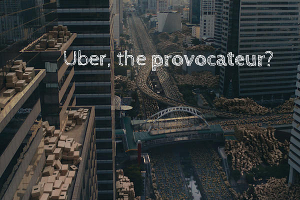

 A still from Uber's "Let's unlock cities" campaign

Ads before a movie screening in the cinema are like the tasty dessert before a meal. With the big screen and surround sound, ads become extra poignant. Recently there was one ad that really stood out for me - I mean, it _really_ popped out.

https://www.youtube.com/watch?v=oNyq2\_92H0Y

Within the first 15 seconds, I saw where the ad was going: it was an attempt to call out the hidden structures that enable so many people to own cars in the city, in a bid to push the ad-owners’ agenda - most likely a purported solution.

I thought it was an ad by the Singapore government, part of their recent flurry of public messages like “Leave the car at home, take public transport.”

But I was wrong. This was not an ad by our government, it was an ad by Uber. Yes, Uber, the giant transport company that has taken the world by storm and the authorities their breath. The Uber logo was artfully revealed only in the last few seconds of the video and when I saw it, I was blown away.

What I saw was a brilliant stab at government policy by a private company. It is aggressive, no-holds-barred, and provocative.

Having grown up in Singapore, I’ve never seen a company ad that called out government policy like this ad did. At first, I thought, “such audacity!” and I even felt a moment of triumph. Finally, some degree of expressive freedom that can be put to use for the greater good.

Then I remembered that this was an ad by Uber, the giant tech company that has toppled taxi oligopolies around the world (good) and is now making flying cars (not sure if it’s good yet). It’s also the company that has operated the insidious [Project Greyball](https://www.nytimes.com/2017/03/03/technology/uber-greyball-program-evade-authorities.html) that targeted law enforcement personnel in the US to make them chase their own tails (bad), and the company that has largely been disrespectfully side-stepping local laws many steps of their way to global dominance.

So we have progressive freedoms in advertising on the one hand and some form of corporate provocation on the other. How can we properly judge the net goodness or badness of the whole thing?

As a technologist, I’m conflicted. I love Uber as a product - their app is nothing short of revolutionary and has changed the way I commute largely for the better. But their corporate culture (Travis Kalanick and the “tech bros”) and marketing bravado have left me in internal ruins.

This ad isn’t the only time I’ve seen Uber giving the government a knuckle rub. I have a vivid memory of a large multimedia ad run by Uber at Orchard Road MRT station. The ad showed an MRT train arriving and a voice that has an uncanny resemblance to the person who reads the train announcements saying, “Please do not eat in the stations or trains. If you’re hungry, I recommend taking an Uber.”

I didn’t record the ad, and I’m not sure how long it was allowed to be aired for, but apparently someone else thought it was provocative (or interesting?) enough to be recorded.

https://youtu.be/2xIcUtRJtgs

On one hand, I’m happy to have more of the public challenging governance because I believe that keeps governments in check and slightly on their toes. But a part of me feels a slight sense of injustice. An American company is undiplomatically meddling in Singaporean government policy. If I’m being hyperbolic, I might call this a new American colonialism. Uber, with its immeasurable dataset on city transportation probably "knows better" than any other organisation how to run an efficient system.

But alas, efficiency itself is not the end game for governance. Liveability, culture, political and economic stability are some of the concerns of governance. Being able to efficiently achieve these goals is great, but not the main focus of the government. Let's be vigilant in telling apart good governance and clever marketing, lest we be misled and turn a blind eye to the issues that invariably accompany technology-enabled change.
