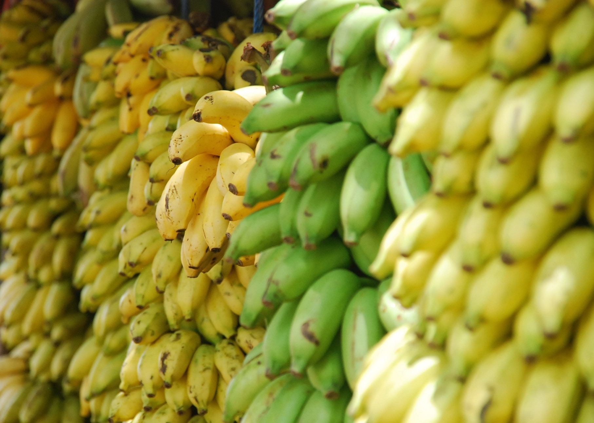

\[caption id="attachment\_2024" align="aligncenter" width="1813"\] Photo by Lotte Löhr on Unsplash\[/caption\]

For the first time yesterday, my long time friend Kegan joined my wife and I on a quick grocery run. Since we've been married, Charlane and I have been buying groceries once every 2-3 weeks, so this trip to Fairprice felt familiar, almost habitual. That's why when Kegan remarked at something I said to Charlane about the bananas she chose off the rack, it was a moment of revelation.

"Those look too yellow," I said. "You should grab a greener bunch. They'll last longer."

Nothing revelatory about that, until Kegan jokingly remarked, "Oh my god, you guys talk like my parents now! _So uncle, 'take the greener bananas' and all..._"

Up to that point, I had not realised that I'd grown to sound a bit like my mum. She would indeed say things like that on our grocery runs together in the past.

> "Make sure the bread you take isn't flat!" "When you buy milk, make sure you squat down and reach in deeper into the shelf and get one with a later expiry date!"

Things like that... I think you get the picture.

Aside from making me aware of my uncle-ness, Kegan's remark also got me thinking about _why_ our parents are sometimes unbearably preachy about the littlest things. I mean, why would do parents constantly remind their children to do things in the way they think is best?

Parents tell their children to crouch and grab the inner-most milk carton because they truly believe that it's the best thing you can do with regards to buying milk.

That's fair enough, considering that they have bought more milk cartons than we have drank cups of milk. But it got me thinking deeper... do their recommendations always hold true? What if, for example, since moving out, Charlane and I drank twice as much milk per day as we did when we lived with my parents? The importance of the expiry date, which is usually about 10 days from the date of purchase, diminishes significantly...

What I'm trying to highlight is the fact that **the merit of any decision we make can really only be evaluated in relation to an individual, or at most a couple of people**. There is no "one size fits all" decision. _Always_ going for the milk with the latest expiry date is a fallacy.

Similarly, _always_ going for the greener bananas is also a fallacy. Charlane and I blend one banana into our morning protein shake about once every two days, which is to say, we consume bananas slow. What if our (future) kids were voracious banana eaters and we had recommended our perceived "best way" of buying bananas to them?

The main insight that I've gleaned from thinking about green and yellow bananas is this: **we should learn to be conscientious of our behaviour (ie. ways of deciding and doing things) and remember that it is a certain way because it has served us well before but not necessarily for the future, and certainly not necessarily for others**. This is probably why wise people tend to hedge their sentences with phrases like "what has worked for me" and "but it's probably because I (do X...)".
