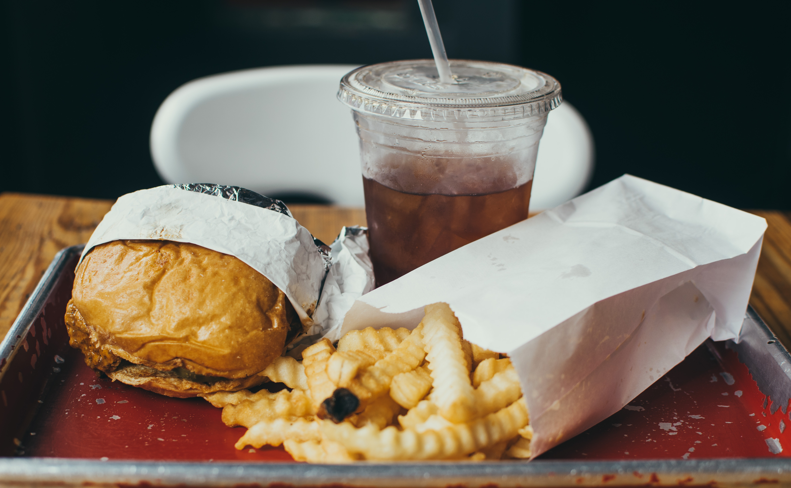

[Food delivery services](https://techcrunch.com/tag/food-delivery/) are awesome. They provide unbridled convenience since they're even faster than fast food when you cut out the travel time. And so far they are relatively affordable.

Amid all the "we take care of X for you, so that you can spend more time on what truly matters" marketing baloney, services like Foodpanda really deliver (accidental pun, but I'll take the credit).

I want to take this moment to appreciate the amazing times we live in. Thank you, [Foodpanda](https://www.foodpanda.sg/), [Deliveroo](https://deliveroo.com/), and [Uber Eats](https://www.ubereats.com/)!

But I also want to point out something that I've only recently realised to be true.

Some say that at the heart of a company like Foodpanda is not technology but people. It is probably not meant as a truism but literally in a "without riders, Foodpanda as a business would cease to exist" kind of way.

But on closer examination, I realised that this way of thinking is belittling technology's crucial role in making food delivery services possible. I say this with caution, knowing that tech has already gotten enough--some say too much--credit.

The sayers would say:

_Technology is important to Foodpanda insofar as they enable riders to get food to hungry people. In itself, the ability to connect people through web and mobile apps is useless._

I wrote that sentence at first, believing it, and then realised that it isn't a fair thing to say.

The key to enabling food delivery services, in their current incarnation with the tripartite relationship between restaurant managers, motorcycle riders with extra time, and hungry people is three-fold:

1. First, getting them to _want to_ communicate with one another and pay for goods and services rendered (marketing)
2. Second, facilitating the food delivery by incentivising riders to deliver (people)
3. Third, having the technological capability to (1) let restaurants list their menus and accept orders online, (2) let hungry people order food online, (3) let riders receive real-time job notifications, and importantly, (4) collect and disburse small payments (technology)

These three things must be well executed in order for a business like Foodpanda to be sustainable. Saying that without riders, these companies would cease to exist would be accurate, but it problematically obscures the other two important pillars of marketing and technology.

Our perceptions are biased. For me, I _feel_ strongly with "people" being the most important, followed by "technology" and then "marketing". But in reality, all three are important.

If the question was rephrased as "What recently changed to enable food delivery services to flourish?", then the answer would clearly be technology. Ubiquitous smartphones and online payments with negligible transaction fees did not exist 10-15 years ago. Now they do, so companies like Foodpanda do too.

The takeaway here (pun unapologetically intended) is this: know what the question is really asking, and know your biases before answering.

Who knew ordering a BBQ Giant Chicken Leg With Rice on Foodpanda would be such food for thought. (Ok, I'll stop!)
