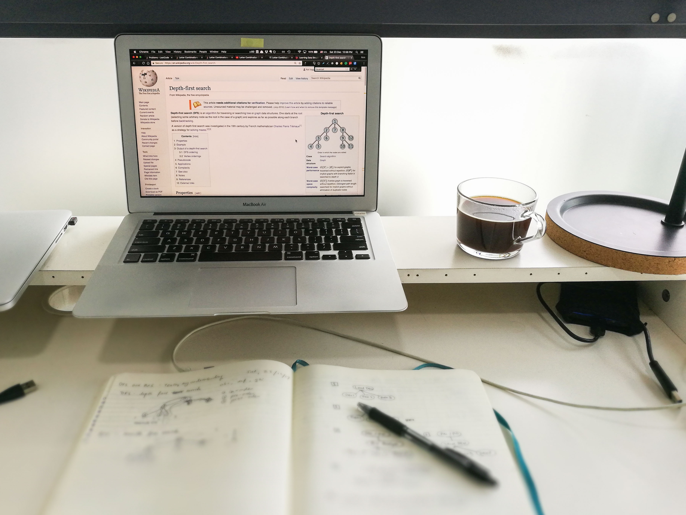

\[caption id="attachment\_2048" align="aligncenter" width="3692"\] What my desk looks like on a good day from working at home\[/caption\]

I'd recently taken up watching Chef's Table during work breaks. I love it for its artful presentation and masterful storytelling. Chef's Table is really not about cooking or even food; to me, it is clearly about humanity and our capacity to create, in spite of our fundamental humanly flaws. It is about the melody of failure and success and learning what matters to each of us.

\[caption id="attachment\_2049" align="aligncenter" width="500"\] Chef's Table poster (I watch it on Netflix)\[/caption\]

That said, Chef's Table is not called The Triumph Of The Human Spirit, and so it is still using food and cooking as the vehicle for moving a story forward. My gut tells me that at least a handful of young chefs have been and continue to be informed by the character of the unique chefs featured in the show.

Now let me get to the point: **I really want something like that for software developers**. I would probably watch it once or twice a week, maybe on repeat.

I want to be informed and, as a bonus, be inspired by the way great software developers who live among us conduct themselves in their craft. There is no doubt in my mind that designing and building software is every bit a craft as cooking is, and from reading the blogs of a few developers like [Matt Mullenweg](https://ma.tt/) (co-founding developer of WordPress) and [Joel Spolsky](https://www.joelonsoftware.com/) (co-founder of Stack Overflow and Fog Creek Software that made Trello), I know I'm not alone in seeing the making of software as a craft.

"Why would you want something like that?", you might ask. Because **I'm a firm believer in learning by watching other people**. Textbooks and other forms of tutorials impart technical knowledge well, but they don't often _show us_ what it is like or what it means to be a great software developer.

While we can certainly learn and create our own definition of what it means to be a great software developer, as many chefs before Chef's Table must have done, we could use a little push to get there earlier.

Let me be upfront here: at the moment, I really don't know what it means to be a great software developer. So in the interim, I'm focusing on technical knowledge and skill. But a good craftsperson does not just know how to use her set of tools - she knows how to deeply affect those who experience the products or services made from those tools and how to reconcile her idiosyncrasies as a person with the work every day, amongst other things.

When will there be a "Developer's Cursor" to provide us with nourishment? Perhaps you already know about something like this (hopefully with a better name), in which case, I'd really like to hear about it! Otherwise, I'll just have to cling on to Chef's Table and attempt to cook up a definition for what it means to be a great software developer and try and work my way there slowly.

* * *

_Enjoyed reading this? I've been writing posts like these revolving around technology, society, and life on and off for more than a year now. This year I'm aiming for 5 posts per week, and I'd love to have you join me on that personal journey. You can read more at my blog or [subscribe](http://eepurl.com/c7xfID) to get the most interesting posts delivered to your inbox - it's free._
