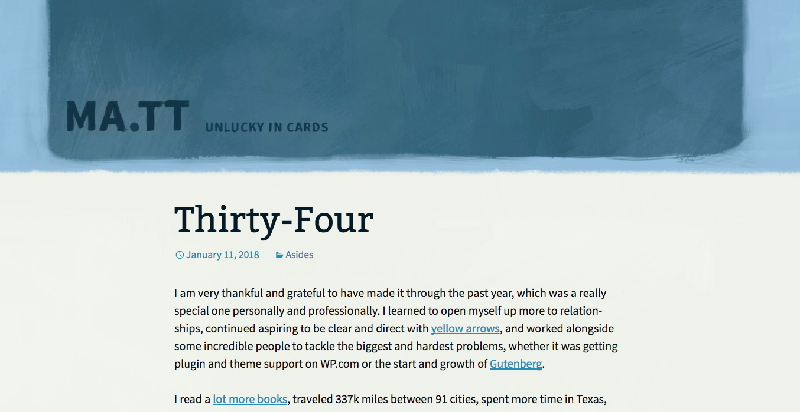

\[caption id="attachment\_2055" align="aligncenter" width="1354"\] Screenshot of Matt Mullenweg's blog\[/caption\]

There are many awesome blogs scattered across the vast internet, but none feels more organic than Matt Mullenweg's [blog](https://ma.tt/).

I've been perusing his blog (is that the right word?) for an hour yesterday and today and who knows how many more hours were spent in earlier spurts of adulation.

For those who don't already know, Matt is the co-founding developer of WordPress - the very content management system I'm using to write this post and publish it for myself and the world to see. This fact naturally makes his blog stand out in the blogosphere, but it's not the only cool thing. A few things that I find interesting about Matt's blog:

- His theme is really good looking and very pleasant on the eyes (I particularly like the grungy, unclean lines conjoining consecutive posts)
- He has developed a custom post system that accentuates different kinds of posts beautifully
- It is a tapestry formed from small moments like sharing a recently-read article and big personal moments like how he felt when his dad fell ill
- The fact that he has been blogging for at least a decade, probably more, coupled with how there's no obvious way to visit the earliest posts except to take a stab at random numbers for pagination

I think the best part about Matt's blog is that it feels very... organic. Thoughts and updates are published into different types of posts in a way that is so natural it's like peering into his personal notebook (except it's available to everyone with access to the internet). Something about that intrigues me.

Maybe I'll explore developing a theme and a custom post system that makes sense to how I use this blog sometime soon. Through Matt's blog, I noticed that the WordPress community has been keeping busy with a huge update called [Gutenberg](https://ma.tt/2018/01/morten-on-gutenberg/) that promises to make publishing more accessible to the average user. Maybe I'll wait. Or maybe I could help reduce the wait ever so slightly by trying to contribute to the open source project if I can just convince myself to undertake the challenge of understanding the code base. Maybe someday, hopefully soon.
