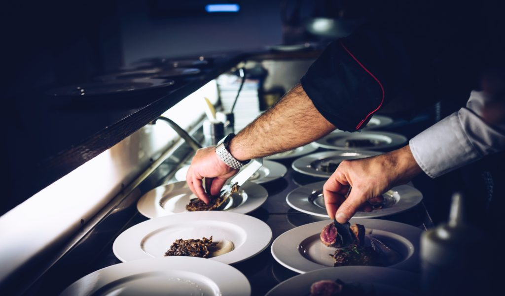

 Photo by Fabrizio Magoni on Unsplash

I've been [watching](/2018-01-14-software-developers-craft/) a little too much Chef's Table recently, so I thought of doing a simplified and quick comparison between cooking and creating software on one front. Not exactly scientific, so just consider it a thought experiment.

First, let's define the two things we're comparing.

By cooking, what I'm really referring to is the whole process of conceptualising a dish, sourcing the ingredients, actually cooking them, and plating the food. Basically, from farm to kitchen to just before the fork.

And by creating software, I'm referring to conceptualising the information architecture, choosing the technology, designing the user interface, and writing the code that binds them together into a single, usable package like traditional software or an app.

### A copy of someone else's food

In the episode that I most recently watched (S01E06), the chef, [Magnus Nilsson](https://en.wikipedia.org/wiki/Magnus_Nilsson_(chef)), said that he disliked his own cooking right after working in the kitchen of a one Michelin star restaurant in Paris.

He said it was like constantly "cooking a copy of someone else's food" - there was no invention, only mere re-creation.

Interesting. Do you know any programmers who have similar thinking? That writing code after reading how _other people coded_ would feel uncreative and recreational?

I'm not sure I've met such a programmer in my life so far, but I sure hope to meet one. And if the wait is too long, like a year or two from now, maybe I should strive to be one? Let a man dream, will ya?

I have no question that the person who conceptualised and wrote the front-end framework [React.js](https://reactjs.org/), Jordan Walkie at Facebook, was (and still is, since React is only 4 years old) such a person.

He must have worked closely with a great programmer or a few. He might have then found it uninspiring or to be outright stifling to be always writing code that felt like a lesser version of what those great programmers wrote, and then decided to _create_. It's just my guess, though.

Maybe that's how something as important as React got created - out of hard study, emulation, dissatisfaction with copying, and finally, creation in the purest sense of the word. Just like the beautiful, unique dishes that great chefs create.
