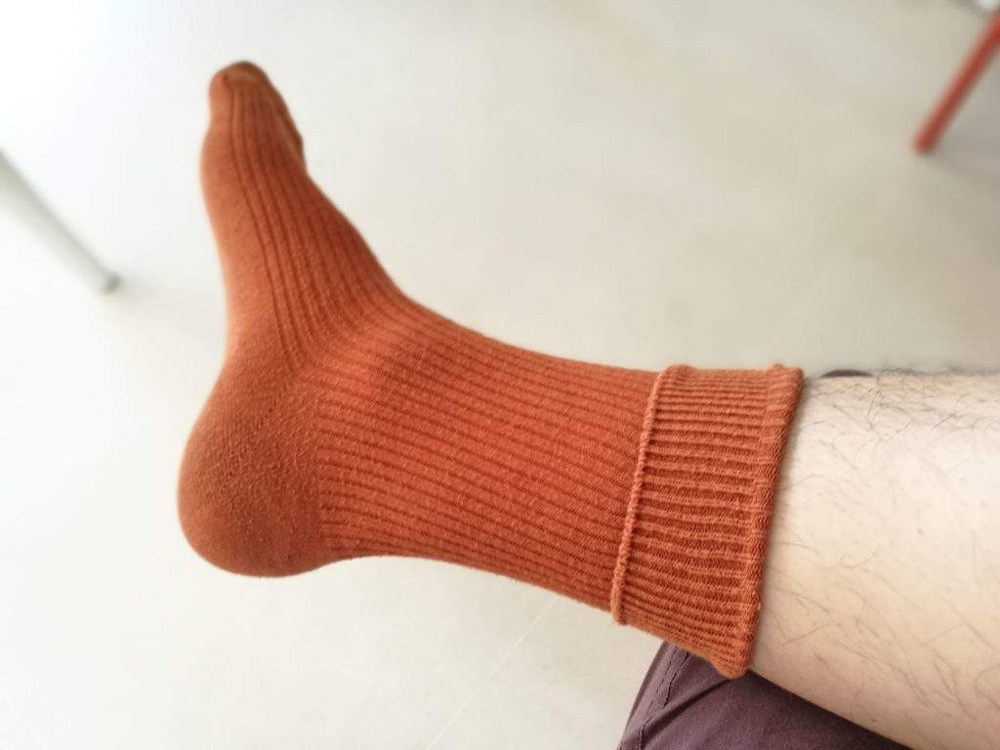
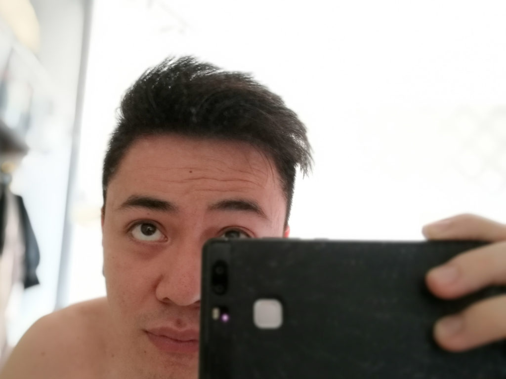

Legend has it that there's a right way to put on your manly clothes in prep for a ball (or in my case, a friend's wedding lunch).

Wearing clothes has always been a thing that kind of just happens, you know, like on autopilot? Perhaps I had to learn it (I'm sure I did, as a noob with my parents' help) but I've forgotten what it was like not knowing how to wear clothes.

So like most people, I imagine, I _just_ put on clothes. But just for fun, not this time. I'm going proper.

### Socks first

First, address the rookie mistake - don't put on your pants before socks!

If you're anything like me, chances are, the pants you're wearing has somehow magically grown a bit tight.

It's one of those mysteries deserving full-length treatment in a separate post, but suffice to say, crossing your leg to slip on that sock can potentially be disastrous (to your pants and to your plans).

### T-shirt off

Next, with your socks pulled up, if you're wearing one, take off your t-shirt.

"Why?", you wonder. Well, because t-shirts are like dredges on the seabed - the seabed being your styled hair.

So, take that raggedy t-shirt you've worn for the thousandth time off before proceeding.

### Give the hair some style while topless (if applicable)

Every gentleman should style their hair, says every gentleman. Thus, if you so choose to be gentlemanly, style your hair now.

 Most wouldn't call this a hairstyle, but I just tend to

Yes, you're half-naked (or fully - doesn't matter), but this is behind the scenes and it's OK.

### Pee or poop now (if applicable)

You probably put on a bit of fat since the last time you got in that pants. No? Oh yeah, me neither...

Clearing your bowels at this point before putting on your pants has the added benefit of reducing your waist size by just a wee bit. Don't underestimate it - it might mean the difference between wearable and suffocating!

### Shirt on, then pants on

Now it's time to suit up. Shirt first, then pants, because you tuck the excess of the shirt into the pants and not the other way around.

### Embellishments on

We're close to the end, so it's time to embellish yourself like a true sculpture to be adored.

Watches and rings and earrings and what-have-yous go on now.

### Shoes on

 My trusty 4 year-old Ecco leather... dress boots? Something like that. It feels and looks great

Bend down to your feet and slip those shoes on. Be mindful of the struggle around the belly area - you'll want to feel for and gauge the maximum tension your pants can take. Everything has a limit...

### Coat/blazer on

Lastly, don't forget the piece that will make you look _just_ like every other (gentle)man in the room. At least you'll look and feel sharp.

## Finally, time to move on

 That's me looking kinda dorky even after suiting up 

Ok off with the charades, I'm just kidding about this whole "proper" shenanigans. Satire is hard!

Get on with life, my friend. You look great because hey, you are you - not because you're properly fancy.
