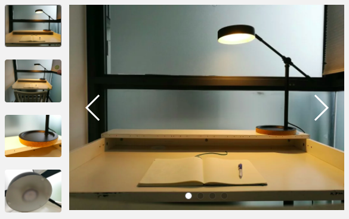

[Carousell](https://carousell.com/) is an online marketplace that is huge in Southeast Asia, grown proudly from Singapore. (What a great name, right? Carousel with a cute, sneaky "sell" at the end?) I remember when the founder, [Quek Siu Rui](https://www.crunchbase.com/person/quek-siu-rui), who's about my age, began the service in obscurity at our university (NUS). With traction, they then quickly rolled it out island-wide and then regionally. It's quite a story!

But more than that, Carousell has been transformational in the way we purchase things as consumers. Nowadays, when I need to get a new thing, I'd go on Carousell before going to a shop or even Amazon or Lazada. (Some items are excluded, like bed pillows, but your tolerance might vary?)

I've bought great electronics (Logitech keyboards, Bose headphones), IKEA furniture, and more from the site, and often at great discounts, without any compromise in quality. Most products are like cars - the moment those wheels hit the tarmac, its value stupidly drops by a large percentage because everyone's afraid you're selling a lemon.

I love using the app (mobile and desktop, doesn't matter) because I get a lower rate for what is essentially the same product, and the seller gets to monetise items that she no longer wants. Pre-Carousell, I imagine a lot of those end up in the landfill.

Apart from environmental and economic benefits, which I've touted many times to my juniors across years at NUS's Bachelor of Environmental Studies program, I love Carousell for being grounds for learning marketing.

Yes, _marketing_.

You see, each time you list something for sale on Carousell, you get an opportunity to package and present (ie. market) your product you're trying to reclaim some value from. It's fertile grounds for experimentation!

I've tried a few things and have learned a lot along the way (especially now that I have my own house full of stuff that I've recently grown fond of getting rid of - to declutter).

One of those things is how marketing can heavily affect how much you can sell a used item for.

### Selling for more than you bought

It's perfectly possible to make a profit from selling a second-hand product! A few qualifiers before you call me a fraud:

- The product is genuinely in a great condition because you've been taking care of it (ie. it is not a lemon)
- The product is authentic, not some cheap imitation that is of inferior quality

I've found that as long as products check these two boxes, the only thing that stands between my way of actually turning a _slight_ profit (which is to say, a great profit, since I've already used the item for a while and derived value from it) is good marketing.

Based on my few experiments, "good marketing" on Carousell comprises of two main things:

1. Beautiful, well-lit photos
2. Description copy that sells the benefits of owning or using a product

For example, I recently sold a study lamp for $29 when I originally bought it on sale at $19 with the following photos and copy.

_Selling this elegant study lamp. Have only used for a few hours in total._

_Features:_ - _adjustable head and arm for getting the best-positioned light_ - _no heat from bulb so no thermal discomfort_ - _on/off control for convenient toggling of light_ - _beautiful metal on cork design_

I used the word "feature" because it felt more natural than "benefits", which sounds gimmicky to me.

To capture those images, I had to spend 5 extra minutes cleaning up my study table and find my notebook, spread it open, and put a pen on it. My Huawei P9 smartphone (which has a built-in Leica lens and software) did the rest of the heavy lifting of capturing sharp images with nice bokeh. I re-shot each photo a few times and picked the best.

The lesson? **Help the potential buyer imagine the good life she would have if only she owned the product you're selling.** You can do that with well-lit images and good copy in the description.

It's actually what all marketers do. Except on Carousell, you are now the marketer.
