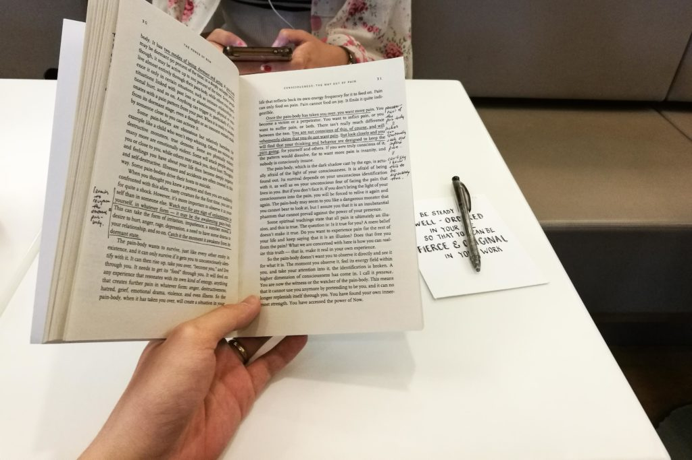

> Be steady and well-ordered in your life, so that you can be fierce and original in your work. -- Gustave Flaubert

What a beautiful quote, right? It espouses the virtues of being balanced in your life, taking care to regularly oil all the parts that make the machinery of you, so that you might nurture the chance of doing good work.

A quote ceases to be merely a quote when it resonates with you. It becomes a belief, and to imbue it with usefulness so that we're compelled to act upon that belief, we might shape it into a [manifesto](https://www.nickang.com/fierce-and-original/).

The quote has been my manifesto, guiding me for more than two years since I graduated from university. But even a diamond that is supposedly perfectly cut might appear to have asymmetry and flaws under intense examination.

I'm beginning to wonder if this manifesto of mine is a potentially asymmetrical and flawed.

### Why is work so important?

I'm just going to go ahead and admit it - I've been reading a book. It's not a typical kind of book in that it audaciously crosses the line between fact and fiction, the scientific and the anecdotal.

_The Power Of Now_ is a brave treatise on the human condition as pitifully dictated by the mind. Its author, Eckhart Tolle, does not hold himself back from using made-up terms that grasp at the truths about spirituality that he has somehow managed to glimpse.

As long as my mind is ready for it, reading the book puts me in a calm but powerful stream of consciousness. Perhaps coffee also has something to do with it. In this fleeting state of mental clarity, I'm better able to see things for what they are. In this sitting, I saw that my beloved quote--manifesto--is imperfect. I saw not just a blemish - I saw a flaw.

\[caption id="attachment\_2139" align="aligncenter" width="840"\] Reading, with my handmade bookmark with my beloved quote on the table\[/caption\]

The quote essentially says that we should ensure our life is balanced so that we can, ultimately, do good work.

But accepting this as a truth is to also accept the assumption that the work each of us does in our short lifetimes is of supreme importance.

Is our _work_ the end all and be all of our lives, belonging to the center of our existence?

No, of course not. I can invent the cure for cancer and still find it meaningless if I don't have my wife and parents to share the joy of my achievement with.

Let me get straight to the attack here: this quote is too presumptuous about what is important in life. It puts work on a pedestal it doesn't belong on.

One could live by this manifesto and grow an outsized pride about one's work. But what--who--is the work we do ultimately for?

Work is secondary to the purpose it serves. Engineers write software to help people navigate daily life with greater convenience, assurance, and consistency. Artists paint, write, sculpt, choreograph, and draw in order to provoke or tease thought in people so that they might be inspired to do something differently.

That pride should insidiously be sown and grown in one who lives by such an apparently beautiful manifesto is a dangerous but important realisation.

I see this revelation as a testament to the power of being in the present ("the power of now"). By freeing my self from my relentless mind, I was able past the fog that shrouds even our deeply held beliefs.

* * *

_I'll be reviewing the book and sharing my notes on this blog when I'm done with it. [Subscribe](http://eepurl.com/c7xfID) to my monthly newsletter if you want to make sure you get it in your inbox - it's free. See you soon._
