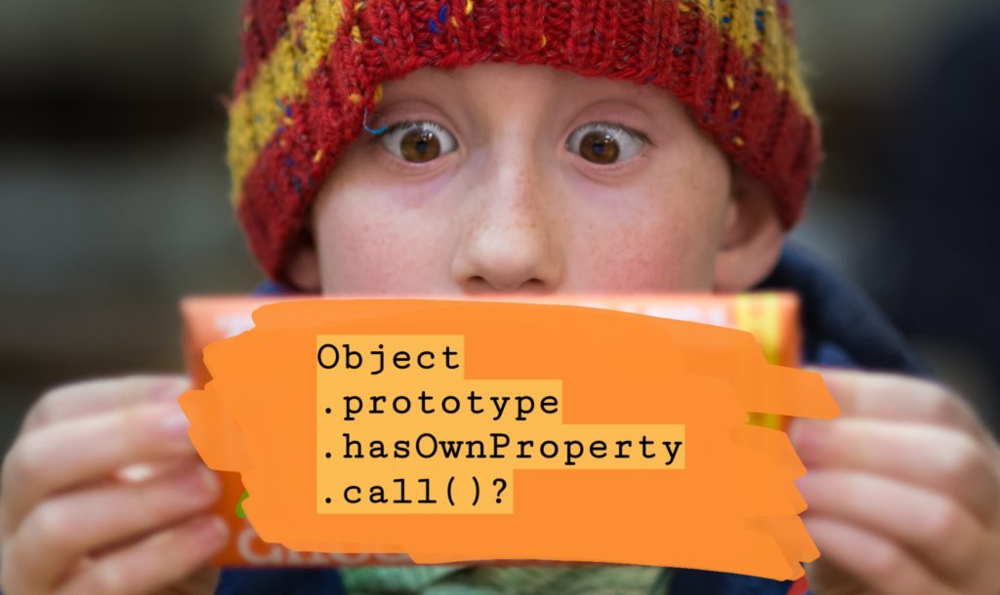

 Original photo credit: Pete Wright

You might have read someone else's JavaScript code recently and came across something like this:

let name = '';
if (Object.prototype.hasOwnProperty.call(instance, 'getName')) {
    name = instance.getName();
}

And you're probably wondering like I did before I dug deeper, why not just use `instance.hasOwnProperty('getName')`? It's much shorter code, which probably means it's easier on the brain and less prone to errors, right?

Turns out, not really. There are two main reasons to invoke the [`hasOwnProperty`](https://developer.mozilla.org/en-US/docs/Web/JavaScript/Reference/Global_Objects/Object/hasOwnProperty) that is on the original `Object.prototype`.

## Reason 1: objects can be created with no prototype

The first reason is the one cited in [ESLint](https://eslint.org/docs/user-guide/getting-started)'s [no-prototype-builtins](https://eslint.org/docs/rules/no-prototype-builtins) rule.

This seemingly overly-verbose approach to checking for a property on an object is actually a fail-safe. Consider an object initialised using `Object.create(null)`:

const hollow = Object.create(null);
hollow.id = 99;

console.log(hollow.hasOwnProperty('id'));
// "Uncaught TypeError: hollow.hasOwnProperty is not a function"

In the snippet above, we initialised a new object using `Object.create(null)`. Because `null` was passed in, the result is an object that is void of the default object's prototype chain. No prototype means no `hasOwnProperty` method.

Wondering why anyone would want a completely empty object instead of just initialising with the object literal `{}`? I did too. Apparently, it's a way of simulating a [Map data structure](https://developer.mozilla.org/en-US/docs/Web/JavaScript/Reference/Global_Objects/Map) in JavaScript before it was introduced in ES6. This hack is not so often used now, but with all hacks, it's good to know it exists, if only just to help us identify them when we see them.

## Reason 2: prototype properties can be overridden

This one should be easier to understand. If something can be overridden, it's safer to refer to the source of truth.

When we call the method that is directly on the object instance, we're one degree (or more, depending on the class inheritance) separated from the original method defined on the `Object` class.

const x = {
    id: 99
};

console.log(x.hasOwnProperty('id'));
// true

// if someone decided to override or tinker with the prototype chain...
x.prototype.hasOwnProperty = undefined;
console.log(x.hasOwnProperty('id'));
// "Uncaught TypeError: x.prototype.hasOwnProperty is not a function"

Yes, I agree that this is an unlikely scenario and that if it does happen on your team, it reveals a serious lapse of judgement of the developer responsible for it. **As a rule, never override an in-built method on the prototype chain!**

But if being _slightly_ more verbose can eliminate the possibility of just one extremely hard-to-spot bug, I'd choose verbosity any day! As an aside, I think that's a big part of what makes TypeScript popular among in the JavaScript community despite its lengthiness.

## Use the source of truth on the Object.prototype

I hope that clears the air for you. The ESLint "no-prototype-builtins" rule was what made me realise this detail, but for you, it might well have been reading someone's code.

Either case, let's opt to use `Object.prototype.hasOwnProperty.call()` from now on. It's just the better way of checking for a property.
