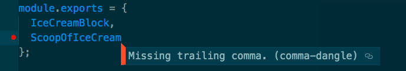
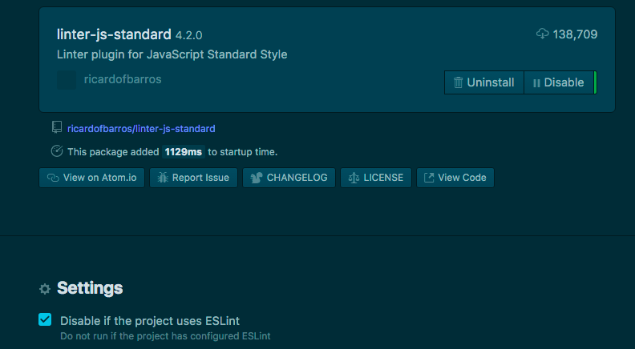

 Photo by Norbert Levajsics on Unsplash

For over a year, I used [ESLint](https://eslint.org/) at work without knowing. I didn't have to understand what package exactly was doing the work of linting - it just worked, quietly doing its duty of enforcing no unused variables and imports, keeping consistent code styles, and all that nice stuff.

But I recently had to learn how to set it up for a project I'm working on on the side - a little concept game unpretentiously called the [Object Oriented Ice Cream Shop Game](https://github.com/nickangtc/object-oriented-ice-cream-shop-game). The name is fortunately temporary until I find a more original name. Among other things, one of the reasons I wanted to do a side project was to _learn from linter rules_ of my own choosing. Quick detour about that, then we'll cover how to setup ESLint for your project.

## Learning from linter rules

I'll write a full post dedicated to this idea, but in short: I believe it's possible to learn _a ton_ about programming from the linter warnings that frantically wave at you as you code. And I'm not just talking about language-specific learning points - I'm talking programming in general.

For example, I learned that having trailing commas when writing object or array literals is a good idea because it provides cleaner git diffs. That's not something I can confidently say I'd have considered until it was made clear to me when my linter underlined it in red and I clicked through on its associated [comma-dangle](https://eslint.org/docs/rules/comma-dangle) rule on ESLint:

Nuff' said. Let's move on to how to setup ESLint for your next project.

## How to setup ESLint

Setting up ESLint for a project is actually relatively pain-free.

First, let's state one of the most important and often overlooked pieces of information you'll need to setup ESLint:

There's **ESLint the npm package**, and then there's the **ESLint code editor package** for Atom/Sublime/etc.

You will need to install _both_ to get ESLint to work as you code. If you install only the ESLint npm package, you will need to run this command every time you want to check your code:

$ ./node\_modules/.bin/eslint yourfile.js

That's obviously not as powerful as having an omni-present code police.

Here are the steps to setup ESLint for your project:

1. Run `npm install --save-dev eslint` to save package to your project's `node_modules` folder and have it listed in package.json under `devDependencies`
2. Create a .eslintrc.js file in your project root directory for configuring project-specific linter rules (alternatively, run `node_modules/.bin/eslint --init` to use ESLint's interactive configuration file generator)
3. Install the ESLint package for your code editor ([Atom](https://atom.io/packages/linter-eslint) | [Sublime](https://github.com/SublimeLinter/SublimeLinter-eslint))
4. Configure ESLint to your needs, installing additional ESLint plugins for specific rules and style guides (eg. eslint-config-airbnb-base for Airbnb's), and for libraries (eg. eslint-plugin-jest for Jest testing library)

### Configuring .eslintrc

Here is an example of my .eslintrc.js file. Note that I chose to use the .js file format, but you can choose .yml and .json and use slightly different syntax.

const config = {
  env: {
    browser: true,
    node: true,
  },

  extends: \['eslint:recommended', 'airbnb-base', 'plugin:jest/recommended'\],

  plugins: \['jest'\],

  rules: {
    semi: \['error', 'always'\],
    quotes: \['error', 'single'\],
    'no-plusplus': \['error', { allowForLoopAfterthoughts: true }\],
    'no-underscore-dangle': 'off',
  },

  // Defines other global variables
  // 'false' means disallow overwriting of variable in code
  globals: {
    $: false,
  },
};

module.exports = config;

With that, you'll have setup ESLint for your project!

One last point before you go.

## ESLint is for ES

One of the reasons I got confused was the fact that there are other linters out there.

Taking a quick look at the code editor packages I have installed shows me 5 different packages:

- linter
- linter-ui-default
- linter-js-standard (for JavaScript)
- linter-rubocop (for Ruby)
- linter-sass-lint (for Sass)

If I'm not wrong, the first two are mandatory for setting up a linter mechanism in my code editor (currently using Atom). The last two are for different programming languages.

But the third, [linter-js-standard](https://atom.io/packages/linter-js-standard), is for JavaScript! Wouldn't this conflict with ESLint?

I'm glad you asked because it means you noticed that ESLint is for ES - as in, ECMAScript, or more popularly, JavaScript. ESLint is a specific linter software that comes bundled with a default set of rules **for JavaScript**.

This is my 6th linter package:

- linter-eslint (to use ESLint to lint JavaScript)

ESLint is project-specific and I believe has become the de-facto standard tool for linting JavaScript. So when your project has ESLint set up, its code will be linted with ESLint and not the other JavaScript linters.

In fact, the linter-js-standard package has a settings option specifically for making this explicit:

Ok, I think that's all the linter know-how any of us needs to get up and running.

Now just write code and trust that your linter's got your back. You should, of course, verify that it's actually working by deliberately making an obvious mistake... but you already knew that.

Happy days ahead!

* * *

_Like posts like these? Subscribe to my newsletter to get more useful posts delivered once a month to your email._

Email Address 

Name
