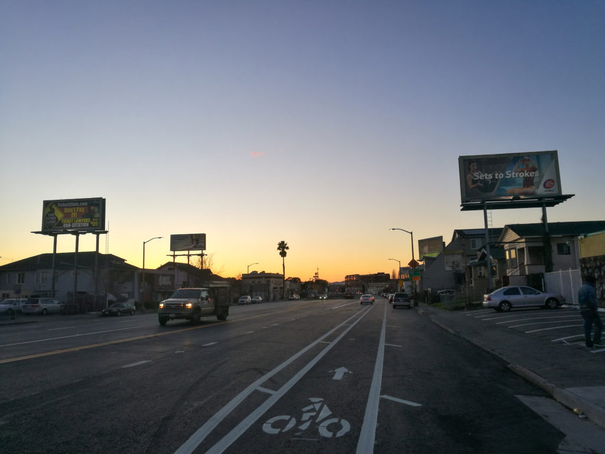

 Somewhere in Oakland along Market Street.

I'm currently in the San Francisco Bay Area for a short vacation. It's been a fun trip so far and it's also quite fruitful as I'm meeting friends who are based here who are mostly working in tech.

As an outsider with my own cultural lens, I can see that Americans are indeed much more individualistic than people in most Asian countries (though I'm generalising a bit, but am probably not too far off). Individualism is the hallmark of American culture.

### Openly disgruntled

I'd only been here for 2 proper days and have already encountered a number of Americans (they may not be San Franciscans) who wear their emotions unapologetically on their faces and channel them into their actions. This manifests as unfriendly and aggressive behaviour that is rare-ish in an Asian society, like Singapore's. An example will help.

In Singapore, if a service staff is feeling overworked or tired, it would be uncommon for her to act like she's entitled to "being herself" and anyone who interacts with would be better off learning to deal with it. Here, I've already had two interactions with service staff who just can't be bothered and expect me to deal with their foul attitude.

In Singapore, although not as much as Japan, people tend to manage themselves and not let their negative energy spill over to their work and people whom they're serving. The burden of suffering is for that person him/herself to bear - not for others to deal with.

Read that last sentence again. It is by no means a superior way of being a person and for a society to behave collectively. Keeping emotions pent up and unreleased will wreak havoc on people's psychology and overall wellbeing. That's why Japan has so high suicide rates and loads of unfathomably fantastical, dark, and morbid manga.

I'm merely pointing out and recording an observation while it's fresh. I'll be in SF for 10 days in total, and I know from experience that that is enough for enculturation and transforming my perspective.

For now, I continue to value being a team player, a responsible partner in a conversation or transaction. My sadness, anger, and fatigue is mine to bear, not yours to tolerate!
