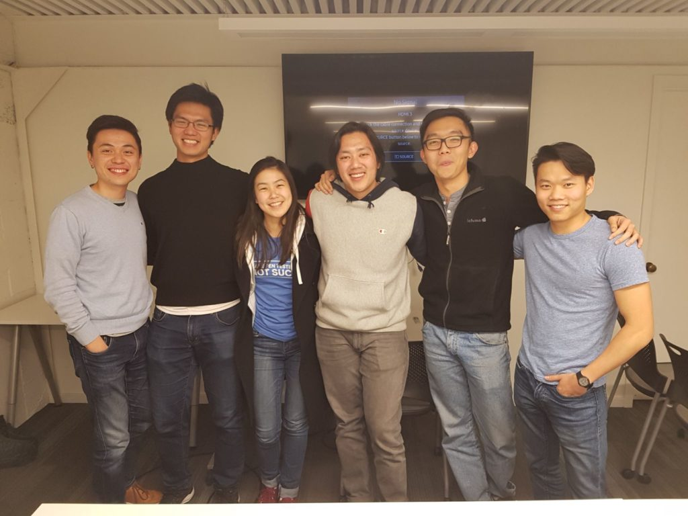

Today was interesting. Despite being a tourist, I got in touch with the right people and put together an Intro to Coding workshop (it was probably more like intro to _web development_) for a small group of [NUS](http://www.nus.edu.sg/) Overseas Colleges (NOC) students. I learned a few things along the way.

But first, a little about the workshop. It was a 2-hour long crash course in web development - how the Internet works, what is HTML, CSS, and JavaScript, and how they all come together to form a web site/app.

Being an alumnus of the [NOC](http://enterprise.nus.edu.sg/educate/nus-overseas-colleges), I knew that not all students in the program are technical, and that could be potentially inhibitive for their work in a place like Silicon Valley, the mecca for software engineers. So I reached out in hopes that I might somehow be able to be useful to them.

With a quick poll, I got a sense that most of those who turned up wanted one of a few similar things:

- To be able to converse with their developer colleagues at work
- To appreciate what's going on behind the apps that their company is working on

Since the workshop was free, why not just show up, right?

So that's the workshop and the premise for hastily putting it together with the student leader (thanks, Xin Ru and Ken!). On to some of the lessons I gleaned from doing this.

## Think of giving, not taking

Giving lowers the barrier to entry to doing something like this. No hidden costs, just giving something valuable for no expected return.

If I had gone to the students here and just asked for contacts and to "buy coffee" for people, it would be a lot less fun and feel much more transactional. I actually had fun tonight.

## Unlikely to happen? Take a chance anyway

I'm here for 11 days and asked my friend Agus (who works for the university) on day 2 to try and link me up with someone here.

Even though that meant that if things went through, the student leaders and I would have to put together a decent workshop in less than 8 days (we did it in 8!).

If things went through, the student leaders and I would have to put together a decent workshop in less than 8 days! (In the end, we did it in 4.)

What's there to lose? I knew if I didn't try, there would be an exactly 0 percent chance of it happening. With that mentality, I just decided to reach out and try it anyway.

 Some of the people who turned up at the Intro to Web Development Workshop @ Blk71 SF (That's me, first on the left)

To be honest, I was ready for it to not happen on this trip. I thought that perhaps in the future when I'm in some other city (or San Francisco again!), it would be easier because I'd have linked up with the right people already. And that would be true, regardless of whether this particular trip's workshop was going to happen. Baby steps!

## People like to help those who help them

This is probably a truism by now, but since I'm experiencing it myself, I'll reiterate it. People like to help those who help them.

Our workshop ended at about 8pm and we went for pizzas nearby after that. Over pizzas, I had an ask of everyone: "tell me about your company, and whether they're currently hiring!"

That led to a series of wonderful stories about life at company X and Y, and most of them offered to refer me to their company (if I decided to apply) knowing that I was looking for a job in the San Francisco Bay Area. I'm incredibly thankful for their generosity.

I suppose this could have happened because I was charming or for some other inexplicable reason like I smelled nice (for the record, I don't think I was either of those tonight).

But this helpful atmosphere does seem to have been created from the fact that it was an evening of learning something together and having pizzas and wine while doing it. There was nothing but helpfulness and intrigue throughout the evening.

* * *

**San Francisco Bay Area - I'm looking for opportunities!**

I'll end off by declaring that I'm currently looking for opportunities to work in the San Francisco Bay Area and will be relocating soon! If you happen to work at a company that is hiring a full-stack software engineer, please get in touch at hello at nickang dot com. :)
