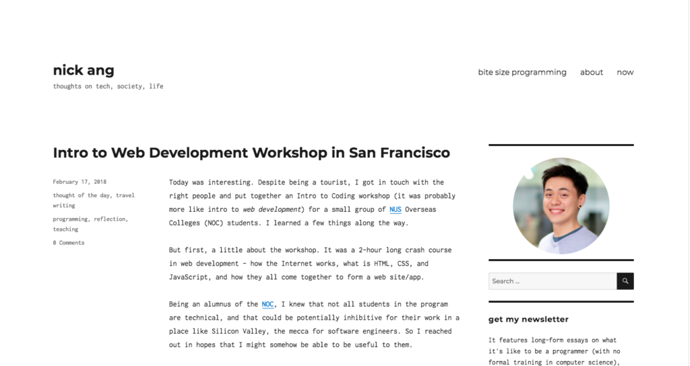

 The old typeface for this blog - bye Inconsolata!

It's official, I'm sick of the [Inconsolata](https://fonts.google.com/?query=inconsolata) font!

The font you're seeing now is good old Georgia, one of the classic serif fonts that have been used in print for decades and continue to be used in websites like [The Financial Times](https://ft.com).

I changed the typeface used on this blog as an experiment. I was curious to see if the modern monospace font would change what it feels like to read this blog. On that front, I largely succeeded, because I managed to feel more foreign visiting my own blog than reading someone else's with a classy serif font.

That's when I knew Inconsolata had to go.

Georgia, you're up next!
