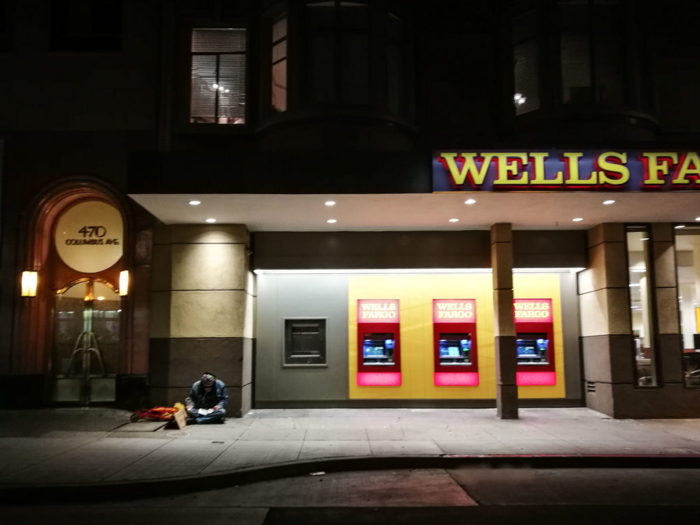

I've been in the San Francisco Bay Area for the last 10 days and have learned a lot about the city and the East Bay and South Bay cities. The thing that keeps coming up? Danger.

Coming from Singapore where danger is literally nonexistent, the Bay Area feels _almost_ too dangerous.

But I'd argue that Singapore is not heaven compared to SF.

Virtually guaranteed safety in day-to-day life has a way of making you complacent and incapable of living fully. There, I said it. I'm complaining about the city I grew up in being too safe.

It may sound ludicrous that someone might be unhappy with living in a place that is "too safe", since first of all, does such a thing exist?

I'd argue yes, a place can be too safe, just as life can be. We've all heard the phrase "playing your life" followed by "too safely", and possibly "you only live once!" Live too safely and, the critique goes, you might end up not having lived at all.

That is Singapore for you. It is too safe. Our streets are clean, both literally and figuratively. There is virtually no trash, and there is almost no crime. Walking around anywhere in the city is danger-free.

Nobody in Singapore pauses to think that they might need to hide their jewellery to prevent a burglary, and practically everyone leaves their laptop at the desk for toilet breaks.

The bad thing about this level of safety is that **people are not kept on their toes**. Deliberation is not a thing because it's not needed.

Like a penguin with wings but cannot fly, people in Singapore live in such comfort and safety that **we become unable to fully engage with our environment**. Our minds focus instead on the menial things, finding fault in them. And everything becomes something we don't experience and live but merely pass by.

## Takeout dinner in Singapore

In Singapore, I'd ride my motorcycle out to get dinner. Because there is absolutely no need to worry about my safety (except of course the possibility of falling off my motorcycle), I often pick on things like the weather to feel miserable about.

When I queue to buy my mixed vegetable rice, my mind is already thinking about what I'm going to do when I'm home. That unresolved argument with a friend, or that obstacle in my project, or whatever. I can do that because there's nothing in the immediate surrounding that worries me, that forces me to stay engaged with it.

## Takeout dinner in San Francisco

Based on what I've seen over the past 10 days, I'm certain that going out to get packed dinner is not such a breeze in cities in the SF Bay Area.

First, there's the point about the weather. It gets really cold here some days, and you either prepare for it or get sick. Maybe even die of hypothermia or something. (Again, no such thing in summer-year-round Singapore.)

Weather aside, there's a good chance of one of a few bad things happening to you:

- Get hijacked by a mentally unstable person asking for money, who will more likely than not shout at you if you don't oblige.
- Have your car window smashed (it frequently happens even in daylight).
- Get robbed of your wallet and other valuables at gunpoint.

This isn't hyperbole, by the way. Ask anyone who lives here and they will tell you the same thing.

This, of course, is a less than ideal way of living. It's so dangerous you can _never_ let your guard down - something bad is likely to happen when you do. That's just tiring.

So perhaps it's not preposterous to think that there might be a "right" level of danger for us to live fully. After all, death is ultimately the only thing that keeps us working harder and loving others. Without the potential to die, I'd probably just watch Netflix all day long for 100 years, and the programs probably wouldn't be all that good, since filmmakers probably can't be bothered either.

The right level of danger is somewhere in between Singapore (not dangerous at all) and the San Francisco Bay Area (too dangerous). That's all I can tell for now.
