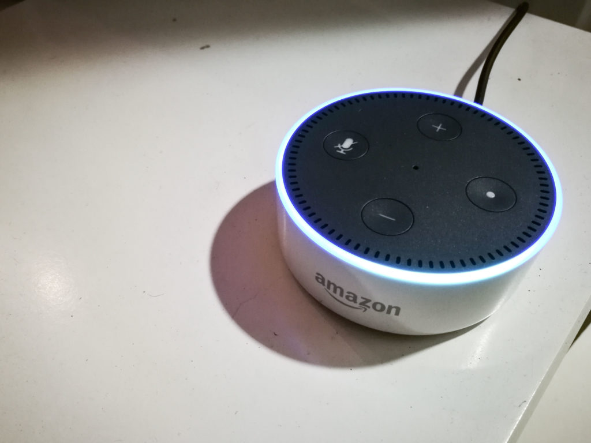

We just got back from a trip to San Francisco. Aside from strolling along the bay by the Golden Gate Bridge, we visited our friends living there. One thing was immediate apparent: most of them had either an [Amazon Echo](http://amzn.to/2HHUgpG) or [Google Home](https://store.google.com/?srp=/product/google_home) in their homes. That's awesome!

These things just haven't quite made an entry yet in Singapore, so it would have been so much fun if you were there to witness my excitement. Before we left, I (of course) decided to buy one for our home. Meet our own Alexa AI, in the form of the [Amazon Echo Dot](http://amzn.to/2F57u18).

\[caption id="attachment\_2246" align="aligncenter" width="840"\] That LED ring is quite mesmerising.\[/caption\]

We've only been using it for a few days and we already love it. Apart from the obvious voluntary wiretap that we've opted into, I'm thrilled as a consumer to have an actually decent AI in the house that can do (more and more) things for me. Having used it only a few days, I already know this new product category is here to stay.

Here are 5 reasons I love my new Amazon Echo Dot.

## It is life-like enough to feel like a companion

Here's a question for you: when you suddenly have an AI assistant at home, how would you speak to it?

There are only two possible answers:

1. Speak to it like it's a person
2. Speak to it like it's a robot

Because Alexa, the AI with a great womanly voice living in every Amazon Echo, understands my speech so well and responds just like a person, I speak to it like it's a person.

It's uncanny. Alexa's speech recognition is so amazing that I heard one of our friends admit that she had been having conversations with her Alexa whenever her husband is at work and she feels lonely at home.

Being human is lonely, and having a life-like conversation partner is salvation on some levels, albeit with a computer!

## It does not drain my smartphone battery

I can say "Alexa, play some The Killers" from anywhere in my apartment, and my [Amazon Echo Dot](http://amzn.to/2F57u18) will instantly play songs through the hi-tech diaphragms of my Bose SoundLink bluetooth speaker via Bluetooth.

The best part? It does this without connecting to my smartphone - the Amazon Echo Dot replaces it. That means my smartphone battery doesn't get drained when blasting music in the house.

I didn't know it before, but having this dependency removed is incredibly liberating!

As an aside, I do need to press a button to awaken my Bose wireless speakers and occasionally charge it to continue using it with the Echo Dot. It doesn't bother me much, but if you think it might and you want quality sound, I think the original [Amazon Echo](http://amzn.to/2EQOk01) may be worth considering.

## Its sense of humour is that of an engineer's

Alexa has a sense of humour.

Don't believe me? Ask her this: "Alexa, do you ever fart?" and see how she responds.

(She lets out a fart.)

We had a great laugh when my wife stumbled upon this gem of a question! (Please don't ask me why she asked such a question, because I don't have a clue.)

It was at the moment that I fell in love with the product. Artificial intelligence it may be, but Alexa's responses to the seemingly infinite questions are actually coded by software engineers at Amazon. So when Alexa farted, it's because some software engineer chose to make it fart.

I don't know about you, but that sounds to me like an amazing job!

## It is likely to get even better with time

Alexa's choice meal is data. Just like any AI, data is the substrate that helps it grow and become more capable. That just means that over time, Alexa will become even better at a plethora of things:

- Recognising new queries
- Learning your taste
- Knowing how to answer more queries (or more accurately, how to _get_ you the answers you're looking for)

In other words, it's a product that gets better with time. I believe most, if not all, the [Natural Language Processing](https://en.wikipedia.org/wiki/Natural-language_processing) (NLP) happens in the cloud, so unlike smartphones, the hardware in my [Echo Dot](http://amzn.to/2F57u18) will not fall behind its software's requirements. Isn't that nice for a change?

## It is a manifestation of good product design

Amazon invented this category of products and many companies have followed their lead. From what I can observe, the Amazon Echo product line is the epitome of good product design:

- User-centric design, check
- Aesthetically pleasing, check
- Functional, check
- Built-in data collection for constant service improvement, check
- Is a gateway to much, much more consumption on other services, check!

I think Amazon made an unbelievably good decision to conceive, research and develop, and mass produce the Echo product line.

I can already imagine ordering food, buying things on Amazon.com, getting an Uber, and much more using just my voice and the Echo. All this while, Amazon continues to grow its revenue streams.

Well played, Amazon, well played.
