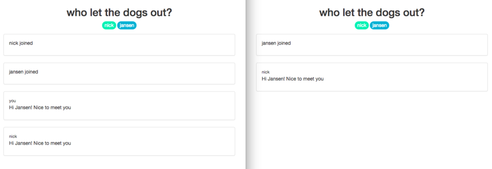

Using [socket.io](https://socket.io/) for your web socket needs? Me too. It's a real enabler of a technology, ain't it?

But even tools good can sometimes have unclear APIs. With socket.io, I came across a subtle but very important difference:

// sample code on Node.js server for a chatroom app
io.on('connection', (socket) => {
  socket.on('chat', (msg) => {
    db.connections.findOne({
      where: { socketID: socket.id }
    }).then(function (connection) {
      // broadcast to other users
      socket.broadcast.to(connection.chatroomID).emit('chat', { message: msg, user: connection.user });
      io.to(connection.chatroomID).emit('chat', { message: msg, user: connection.user });
      console.log(\`## ${connection.user} said: ${msg}\`);
    });
  });
});

What's the difference between these two lines?

// option 1
socket.broadcast.to(connection.chatroomID).emit('chat', { message: msg, user: connection.user });
// option 2
io.to(connection.chatroomID).emit('chat', { message: msg, user: connection.user });

Both seem to emit a 'chat' event with data that contains the message. But they are **not** the same:

- Option 1: `socket.broadcast.to().emit()` will send data to all connected sockets _except_ the one that originally emitted the event
- Option 2: `io.to().emit()` will send data to all connected sockets _including_ the one that originally emitted the event

## Chatroom use case

Here's a [real use case](https://github.com/nickangtc/HTHT-chat) drawn from my own struggles.

Imagine you're building a simple chatroom. When a user joins, she is connected to the server via a web socket (socket.io). Now imagine two users, Sarah and Robert, joins your chatroom.

When Sarah user sends a message, her browser (client) emits a 'chat' event and sends the message data along with it to the server. Because you're using [React](https://reactjs.org/), you choose to update the DOM with the submitted message immediately to provide an amazing user experience, knowing that the chances of message delivery failure are quite low. As a result, Sarah sees her submitted message appear on her browser instantly.

Now Robert needs to see the message. When the server receives the 'chat' event along with the message Sarah sent, you can really only use 1 of the 2 options discussed above.

\[caption id="attachment\_2251" align="aligncenter" width="840"\] Left is nick, right is jansen. If you use the wrong method, you'll get repeated messages for nick - bad!\[/caption\]

As you can imagine, I used the wrong one and found out the hard way. To help you save time, here's the answer: you should only broadcast the message to all connected sockets _except_ Sarah's. Otherwise, Sarah will see her message repeated a second time in her chat client. Oops!

Happy building!
