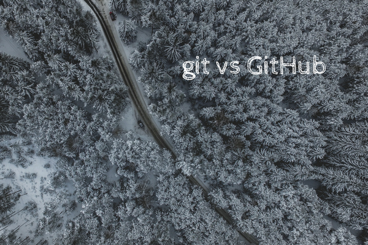

 Photo by Paul Gilmore.

New to programming and heard about the usefulness of git and GitHub? In this article, I'll give you the only quick and dirty summary that you need to have a clear conceptual understanding of what these things are and what they're not.

## Git is not GitHub, and vice versa

Let's get the most important potential confusion out to the way first:

> git is not GitHub, and GitHub is not git.

Now we're ready to move on.

## Git is free version-control software

Git (not GitHub) is free version-control software.

In one short breath, git is software that helps keep track of different versions of your folders and files as they change over time.

Here is a fun and relevant fact: git is free software developed by the same guy who gave the world the Linux operating system, [Linus Torvalds](https://en.wikipedia.org/wiki/Linus_Torvalds).

It is designed to do two main things:

1. Help you track changes in your files in a particular directory (aka folder).
2. Help you collaborate with other developers on the same code base (ie. the same folder)

With git installed in the computers of everyone on your team of developers, for example, you'll be able to each make local changes to the same files without having to go through line by line the changes to merge them later on. Git will intelligently merge files for you when you ask it to.

When your latest changes are finally ready (eg. new feature done!) and you want to merge your files with your co-worker's changes, git intelligently merges them and alerts you if there are any conflicts. If there are no conflicts, the merge happens without a hiccup and you'll end up with your latest files _and_ your co-workers' on your local machine.

And if there's a conflict detected, git will helpfully point them out in the file (by inserting text into the files with conflicts at the exact lines where they clash) for you to choose what changes you want to keep and delete.

So that's (g)it! For more details, you can read my [post on git](/2017-11-03-what-is-git/). Cool, so what about GitHub?

## GitHub is a company with commercial products

The core product of GitHub is... well, GitHub. It's a "hub" in the cloud for folders (called repositories). One folder and all its contents are one repository on GitHub.

It is safe to think of GitHub as something similar to Dropbox, except instead of syncing automatically all the time (which would be disastrous for a team of developers working on the _same files all the time_), you have to manually sync changes by run "push", "pull", and "merge" commands.

So GitHub is a place where you store folders with its contents, and multiple people can work off the same set of folders at the same time on their _local computers_.

Working with GitHub involves making a copy (called "pull") of what is on the cloud (ie. GitHub) on one's own computer, making edits, saving (called "committing") them locally, and then saving them on the cloud (called "push").

So where does git come in in GitHub?

I'd like to give a simple answer to this, but there isn't one because git is baked deeply into the core of the GitHub product. But if you held a gun to my head and forced me to give an answer or my life, it'd be this:

> GitHub is basically a powerful web UI (user interface) layer on top of git that extends its functionality, on top of being a cloud storage service.

Commonly used GitHub features are:

- Creating a "pull request" (the enabler of open-source contributions by strangers)
- "Forking" a repository to create a copy of someone else's code in your own GitHub account
- Submitting an "issue" to a repository to flag bugs to the person/team maintaining the project (which facilitates discussion)
- Viewing user profiles (of software engineers, mainly) to get a quick sense of the work they have done and are currently working on

And that's really all you need to know about GitHub!

## 1-minute summary

- Git is not GitHub, and neither is GitHub git.
- Git is free software for version control.
- You use git on your computer via the command-line interface ("Terminal" for macOS, "Command Prompt" in Windows).
- GitHub is actually a company with multiple products, one of which is called GitHub.
- You use GitHub via their website www.github.com
- You can use GitHub to store a copy of your project folders and files in the cloud - so that you have a backup but also so that other developers can work on the latest project files with you.
