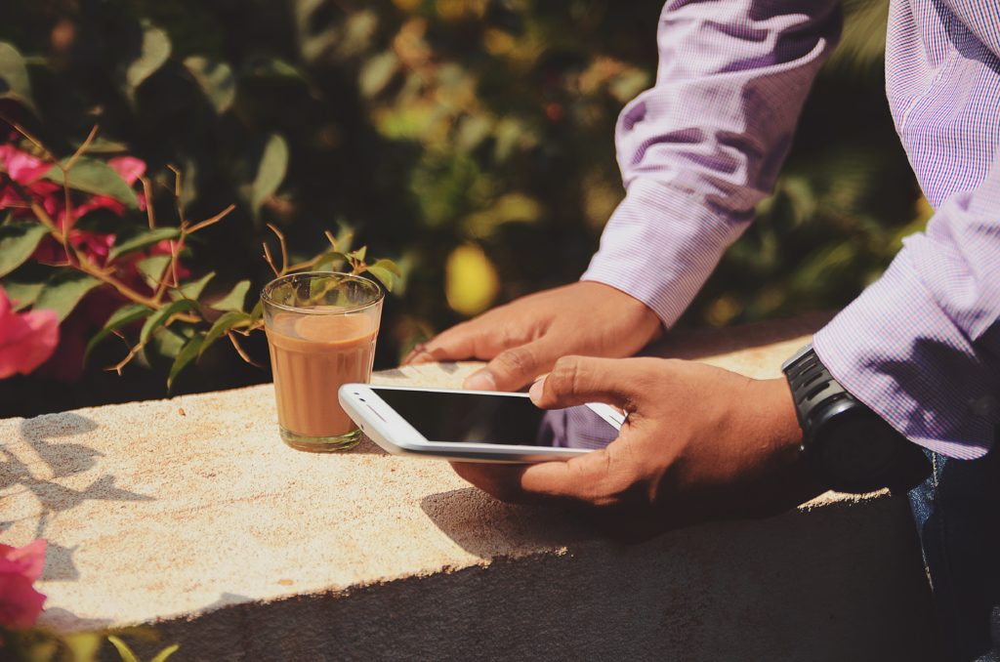
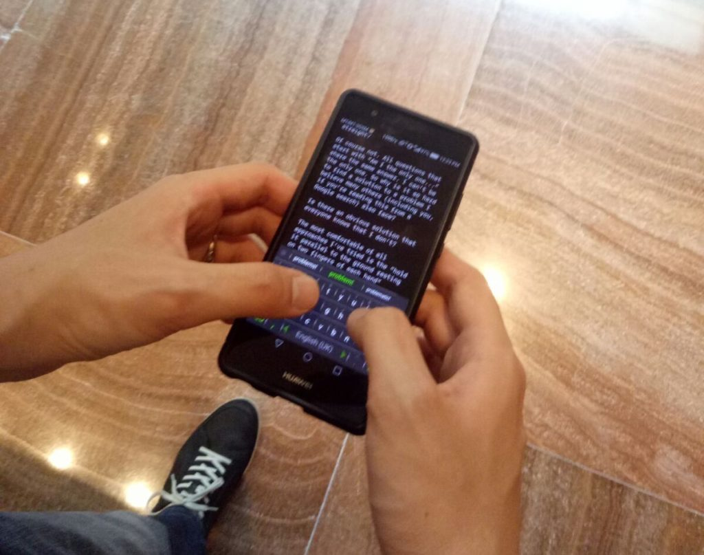

\[caption id="attachment\_2267" align="aligncenter" width="840"\] That hand is gonna cramp up any moment now...\[/caption\]

Have you ever had cramped hands from thumb typing on your smartphone? I'm experiencing it right now as I write this in a hotel lobby without my Macbook and [Logitech Keys to Go](http://amzn.to/2tcjKIL), and it is incredibly frustrating. I feel like punching a pillow after every full stop!

I actually invested my limited thumb presses in googling for "best way to hold smartphone for least fatigue", to no satisfactory result. Am I the only one in the world whose hands get painfully cramped after typing on a smartphone for 10 minutes straight?

Of course not. All questions that start with "Am I the only one..." share the same answer. I can't be the only one. So why is it so hard to find a solution to a problem I believe many others (including you, if you're reading this from a Google search) also face?

Is there an obvious solution that everyone knows that I don't?

\[caption id="attachment\_2271" align="aligncenter" width="840"\] The most comfortable way I could devise to hold my phone for prolonged typing.\[/caption\]

The most comfortable of all approaches I've tried is the "hold it parallel to the ground resting on two fingers of each hand" approach. It largely solves the cramped-hands problem, but introduces a cramped neck problem!

If you have a solution that doesn't involve a separate device or contraption to work, I'll write you a love letter with my thumbs to thank you!
