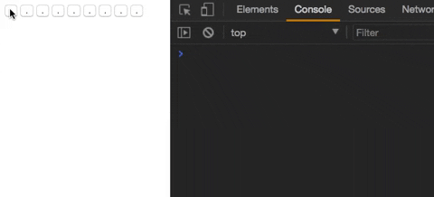

In web development class today, many of our students faced a problem adding event listeners to an array of HTML elements (ok, DOM nodes to be specific).

Imagine you have a grid of 9 buttons forming a tic tac toe board in your HTML page. You want to console log the button's index number when it is clicked, so you pass a function called `logButtonIndex` that will be invoked then.

```js
var allButtonsOnPage = document.querySelectorAll('button');

var logButtonIndex = function(buttonIndex) {
  console.log('buttonIndex:', buttonIndex);
}

for (var i = 0; i < allButtonsOnPage.length; i++) {
  allButtonsOnPage\[i\].addEventListener('click', function() {
    logButtonIndex(i);
  });
}
```

But when you run it, this code doesn't actually do what we want!



Instead of logging the value `0` when I click on the first button, it logs `9`. In fact, all the buttons log the value `9`! What's happening here?

### Scope

To be technically precise, this happens because by the time the button is clicked, the value of `i` in the "for" loop **scope** is already at `9`, even though at the point of doing `addEventListener` the value of `i` was correctly 0, 1, 2, etc.

Scope just refers to the context in which your variable was declared. So the variable `i` in the "for" loop. The problem is that our event listeners are sharing the same scope when we use a "for" loop...

### Solution

There are many possible ways to resolve this problem, but the one I find most intuitive and involves the least fiddling is with the `forEach()` method that is built into arrays in JavaScript.

```js
allButtonsOnPage.forEach(function(button, index) {
  button.addEventListener('click', function() {
    logButtonIndex(index);
  });
});
```

This works because within each iteration of `forEach()`, a new scope is created, and the value of `index` is fixed to the correct value in that scope. So subsequently when the click happens, the correct value of `index` is used and logged to the console.

Another solution, which may not work for all browsers at the time of writing, is to use the block-scoped `let`. Here's the way to do it with ES6.

```js
for (let j = 0; j < allButtonsOnPage.length; j++) {
  let button = allButtonsOnPage\[j\];
  button.addEventListener('click', function() {
    logButtonIndex(j);
  });
}
```
### Thoughts

This is one of those off-putting things about JavaScript in my opinion, especially for beginners picking up programming via web development (ie. HTML, CSS, JavaScript). To me, it's just a quirk that shouldn't exist. It adds unnecessary burden to learners, giving them yet one more thing to remember about the language.

If you're feeling lost about why this happens, don't worry about it. It's a quirk, and it's not your fault.

I hope this article helped clarify the issue!
