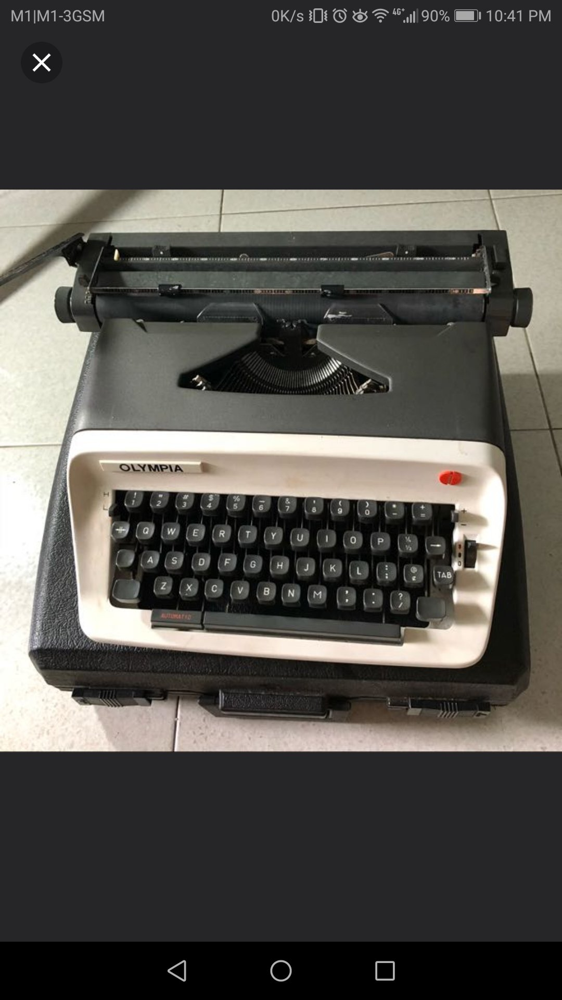

One of my few struggles today was to reason with myself to buy (or not) this typewriter for $120

What's daily life if not a series of subjective experiences?

If the only life I know and can possibly understand is through me--that is, my own subjectivity--then it's really the only thing that I can think and write about!

Before you think I'm mad, let me just be specific - I'm thinking about this in relation to blogging.

A friend of mine from secondary school, Vashon, is currently working at HP in the San Francisco Bay Area, and he's been publishing an Instagram post everyday for the past 200+ days (if I'm not wrong). His posts are unapologetically subjective, and I love reading them!

But I often hold myself back from blogging the way Vashon is doing. I think it's too subjective to be of any value to anyone else (you) other than me. God knows that has prevented me from writing some fantastic posts, but probably also prevented me from publicly embarrassing myself.

That said, I find it strange that Vashon's daily Instagram posts are so alluring to me. Why would that be the case? His captions are 2-3 paragraphs long (and sometimes longer) and they're all so... personal. About what he did at work today. About who he met and what conversations he's had. About the fears he is currently facing and having to grapple with. All of that.

The only logical explanation is that this is the stuff that matters. Our subjective experience should not pale in the face of scientific or "objective" writing.

There's a place for both to coexist, and one isn't superior to the other.

So that's what I've been thinking today. Just sharing my subjective experience with you!
