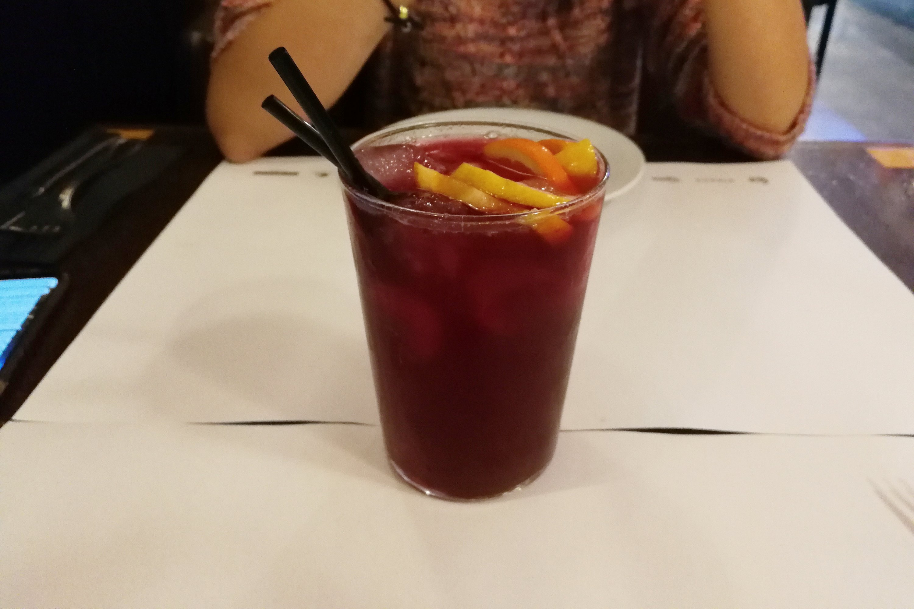

Sangria, the fruity Spanish cocktail that is served in practically any cafe and restaurant in Barcelona, is absolutely divine. I've never loved an alcoholic drink as much as sangria!

The best part? It's practically the only drink my wife actually enjoys - that just puts it in its own category.

Reasons I love sangria:

- It tastes fruity and is both refreshing and alcoholic
- You can finish half a liter of it and get just a light buzz, which means you can drink even more!
- My wife loves it, and she's never liked alcohol

And here's the thing: I don't even know what goes in a glass of sangria! I will be finding out though. This irresistible drink has a permanent place in our home.

One tip to share - if you're in Barcelona or any other part of Catalonia, consider getting a less traditional but even more delicious version of sangria called Royal Sangria. It's basically traditional sangria generously mixed with cava, the Spanish version of champagne. A glass of "royal sangria" in a typical restaurant should cost less than 10 euros, which is way cheaper than champagne but even tastier!
