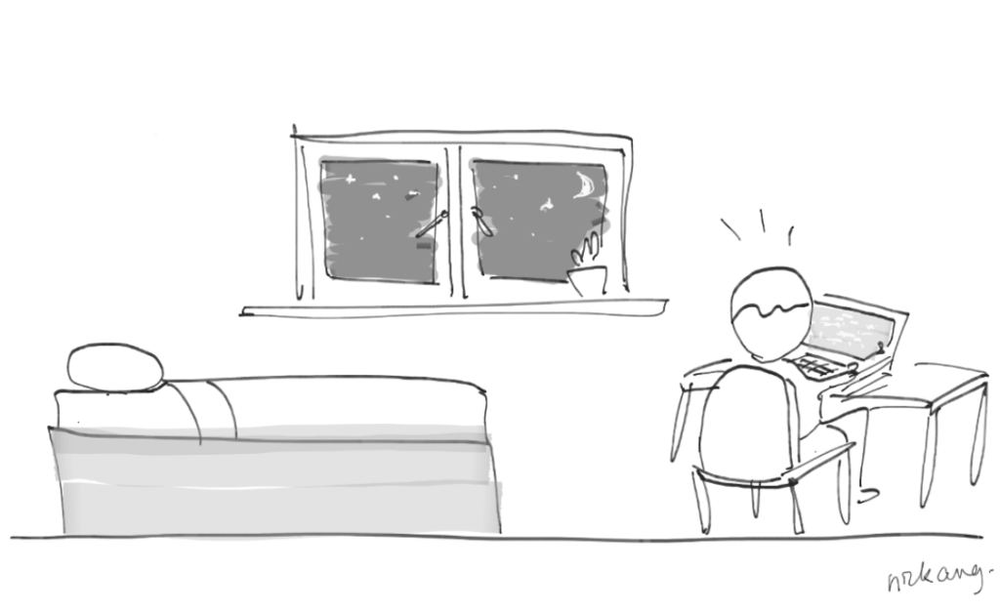

"Do more," says Casey Neistat. "Be the hardest worker in the room," says Dwayne 'The Rock' Johnson. "Wake up before everybody else and work into the night. Hustle", says Gary Vaynerchuk.

This is the air we breathe on social media, day in, day out. It's unsurprising that productivity has become the singular metric we've learned to use to measure everything that we do. Having grown up in Singapore, I'd go so far as to admit that productivity is close to the core of my identity.

While I don't think productivity is a bad metric, I think it needs to be considered critically. Some situations do not call for productivity in the traditional sense. For example, if you sign up for a marathon, you wouldn't ride a cab to the finish line even though that's the most productive thing to do.

But let's dwell within the paradigm of productivity that we're used to for now. In the world of doing more and being the hardest worker in the room, is resting less (hence having more time to work) really productive?

When I have _too little_ rest, what really ends up happening is that I do more work that needs more work to be considered good work. So to hold myself to a high standard, consistently creating good work (which leads to satisfied users, customers, and colleagues), I think it is actually more productive to rest more.

Rest that is below your personal threshold translates to lower productivity. Not more.
