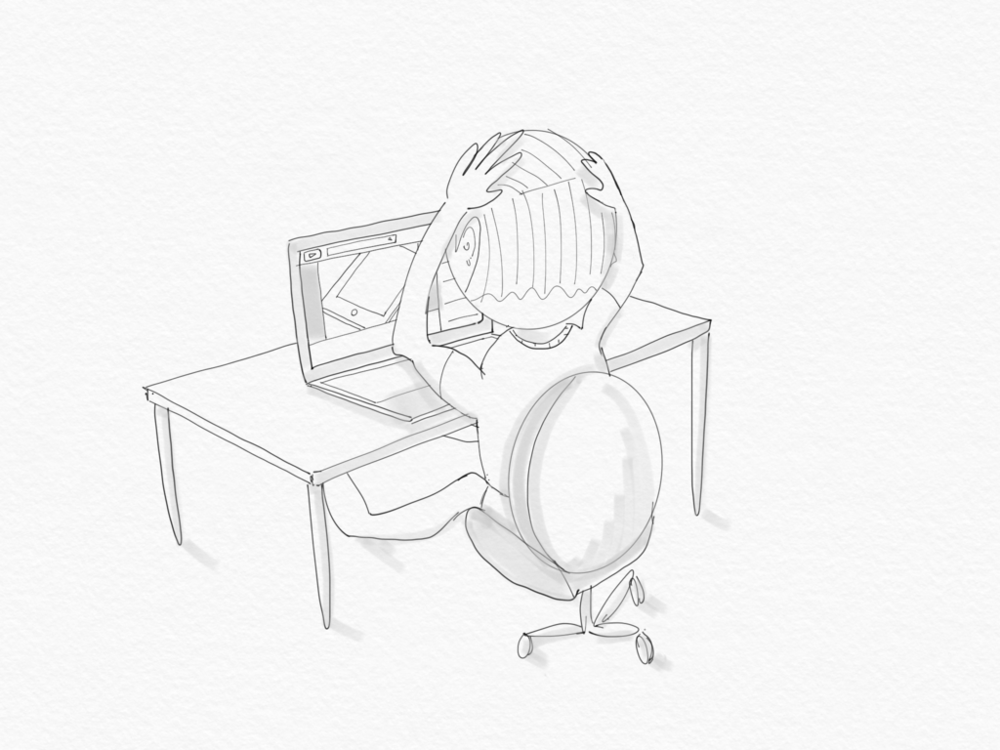

\[caption id="attachment\_2474" align="aligncenter" width="840"\] What I look like in my room watching YouTube videos of other artists drawing on their iPads\[/caption\]

I just invested SGD $640 to buy an iPad 2018 with an Apple Pencil, and the first I did after some super amateurish doodling was--you guessed it--watching YouTube videos. Of other people drawing with theirs.

This bad habit is a weed in the garden that needs to be nibbed in the bud!

If I were honest with myself, I've been YouTubing things like "ipad pencil drawing" with absolutely no purposeful intent. It's classic procrastination. Why do the potentially soul-crushing work of creating something when you could just watch someone else do it?

Aside from being mindless, I noticed that watching videos of other artists sketching actually made me feel _less_ adequate to pick up the Apple Pencil to draw! _Those_ guys are artists. I'm just a guy who doodles when he's bored in class (which is true). So now, not only am I wasting time I could have used to sketch, I am also demoralising myself. Why do I do this to myself?

Of course, this isn't the first time I've caught myself and people around me doing this. It's the consumption autopilot that thinks it's doing us a favour by absorbing more knowledge. But it misses is that humans are mostly a bag of emotions, not rationality, and everything we consume does something to our psyche.

In times like this, it's useful to go back to reason.

I bought the iPad with Pencil support so I can get reacquainted with drawing stuff again. Drawing was something I used to do a lot more when I was younger, from primary school up to the end of secondary school right up to when I had my first girlfriend. This piece of my history gave me the confidence to invest so much money into the iPad. I literally have no other planned uses for it.

Another important reason is that I want to spruce up this blog. I believe a blog doesn't have to be either textual or with photographs. Sometimes, hand-drawn sketches can convey a clearer message. While the words on the page will always remain the centrepiece of a blog (otherwise it'd be a vlog or a podcast), I wanted to add some sketches to bring my blog just a little closer to what a vlog is.

So those are my reasons for getting these new tools. Now all I need to do is get off YouTube, stop comparing my art with other artists', and just sketch. I will be posting more sketches in the coming days!
