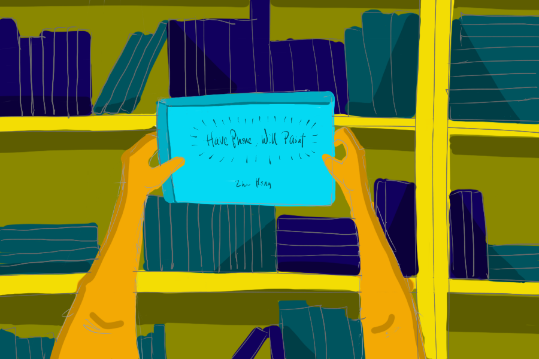

\[caption id="attachment\_2484" align="aligncenter" width="900"\] After hesitating a bit, I decided to pay for my first book by a local artist\[/caption\]

I was in one of the most hipster (and gentrified) towns in Singapore--Tiong Bahru--with my friend Kegan today. After a good meal at Forty Hands cafe where we discussed workplace culture, whether an iPad Pro was a proper computer, and how great it is that they named _Kong Bak Pao (Asian Sliders)_ instead of the other way around on their menu, we walked across the street into a local bookstore.

## Never have I bought

[BooksActually](https://www.booksactuallyshop.com/) has been in my imagination for a while now. From what I hear, it is a local bookstore that also runs a print shop to publish critical works from local authors, and it is the gathering place for many local authors, bookworms, and other kinds of creative types.

I've also walked into the shop on several occasions whenever I'm in the area. It's the size of a typical secondary school classroom except elongated into a rectangular layout, with the glass door entrance at one extreme end and the cashier at the other. The layout is incredibly cosy.

Nice as it is, I've never been compelled to buy anything there.

It's not that the books aren't interesting - they were, and there were a lot of original work by local authors proudly on display throughout the shop. But because of the limited low-volume print runs, many of them are quite expensive.

Today, though, I made the plunge for the first time. And I think I'll credit timing.

## Sentiments for Singapore

As I contemplate relocation and think about leaving Singapore for work in the near future, I've grown fonder of my country, and I think my newfound sense of belonging has created a soft spot for many things local. I've also recently started creating more art in my free time, which has made me appreciate people's artwork more.

That said, I'm not some new-me that is all about local, local, local. This is just my first baby step towards engaging the Singaporean community of creators.

I like that many of these books are about sparking important thoughts and facilitating conversation about Singapore, like [_'Others' Is Not A Race_](https://www.booksactuallyshop.com/products/others-is-not-a-race) by Melissa De Silva, an attempt to bring the Singaporean Eurasian community out of obscurity. I'm embarrassed to admit, I know absolutely nothing about Eurasians in my country outside of what I'd read in textbooks.

I realise I'm weaving in and out of this post, so I'll tie the knot by sharing my purchase. I bought a book by the local painter, Zhu Hong, called [_Have Phone, Will Paint_](https://www.booksactuallyshop.com/products/have-phone-will-paint-by-zhu-hong). It's a collection of paintings done on his Samsung Galaxy Note smartphone in coffee shops, MRT stations, and public housing.

After hesitating a bit, I decided to pay $29 to buy it because I like his aesthetic, selection and portrayal of things, and the fact that he created brilliant work using just a smartphone. At the very least, I've paid for a memento from an inspiring trip to the bookstore. At best, I've just supported an artist from my community to continue creating soulful work.
