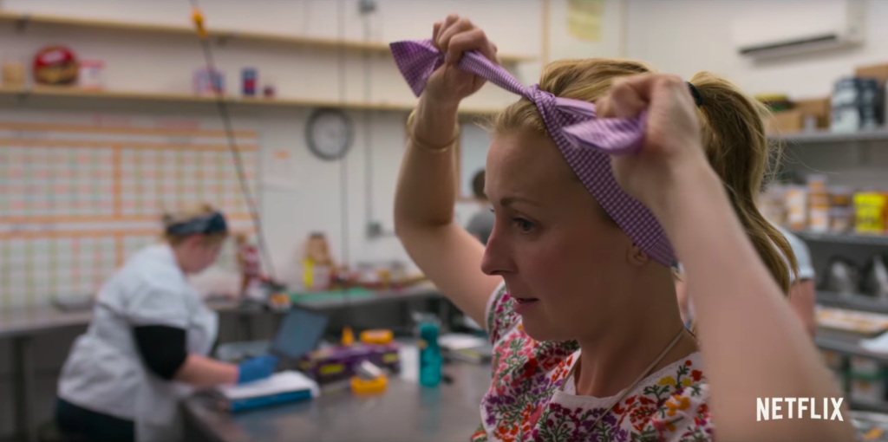

We can sit and watch people do amazing things, get inspired, and then do nothing. Or we can also do some amazing things.

Doing _anything_ requires effort, let alone amazing things. So don't ever think it will be easy! It's as [Mark Manson says](https://www.goodreads.com/book/show/28257707-the-subtle-art-of-not-giving-a-f-ck), "What pain do I choose to sustain?"

It's safe to assume that we all want to be producers of amazing things, right? Although what elicits amazement differs for people, is it not true that deep down, each of us wants to be the one responsible for creating a "Holy fuck, this is AMAZING!" moment in people?

You can be the one who baked an amazing cake that left everyone at the dining table speechless.

You can be the one who wrote an amazing essay that resonated so well that it made a reader cry.

You can be the one who sang an amazing song that provided a window into catharsis for a listener.

You can be the one who dared to stand up to tyranny and rallied a group of people to do the same.

You can be the one who created an amazing personal narrative that continually inspires millions by uploading a video log every single day to YouTube.

You can be the one who brewed amazing coffee everyday that catalysed people's thoughts into actions.

You can be the one...!

There's so much we can do with our life. Let's go do them, instead of letting others have all the fun!

* * *

_I was inspired to write this mini-essay after watching [Chef's Table](https://www.netflix.com/sg/title/80007945) (not the first time). Christina Tosi is an American pastry chef who, based on the story that was told in the documentary, makes amazing cookies, cakes, and breakfast cereal-infused milk. Her story really inspired me, and if you haven't watched the episode, you should - and you can find it on Netflix. It's worth your hour!_
