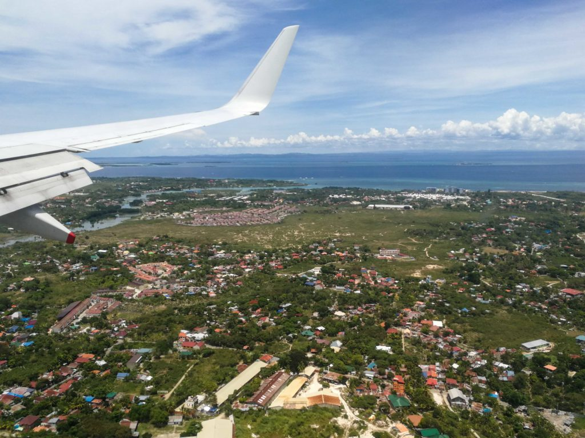
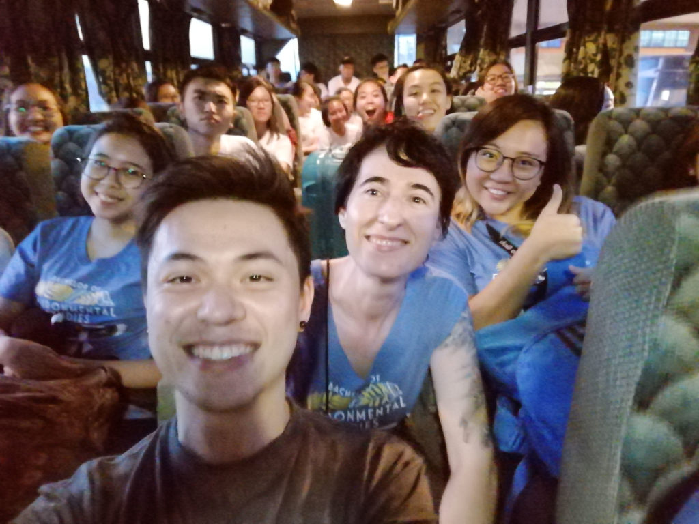

\[caption id="attachment\_2557" align="aligncenter" width="840"\] Touching down at Mactan-Cebu International Airport\[/caption\]

This has been an interesting year for me so far. I started the year having just left my [previous job](http://altitudelabs.com/) as a software engineer, received an offer to be a lead instructor teaching web development on the weekends and teaching assistant on the weekdays at a reputable [technical education company](https://generalassemb.ly/). Now, I'm in the Philippines to help teach a field course for my [bachelor's degree](https://envstudies.nus.edu.sg/) program, and in June, I'll start work as a customer-facing software engineer at a growth-stage tech startup.

These opportunities to teach came at a great time because I was in the middle of a job search. One of my biggest goals in 2018 was to look for a role in the San Francisco Bay Area as a software engineer. I was trying to fulfil a dream.

After four months of talking to friends, friends of friends, recruiters, and applying cold to companies, I decided to take a job at a company I felt drawn to because of their product and team culture.

That job, however, will be based in Singapore and not SF. They do have offices in several cities including Helsinki (HQ) and San Francisco, though, but I will have to prove myself and contribute to the Asia Pacific (APAC) region before being considered for relocation, as the leaders tell me.

Thankfully, from what I can tell, they are genuinely concerned about aligning each employee's personal goals with the company's, and there does seem to be a legitimate business reason for relocating people between the various offices. I sure hope I didn't misread things here though.

So, that's that. In June 2018, I will start as a Service Operations Engineer at [Smartly.io](https://smartly.io) - a marketing automation and optimisation company with a powerful product and best-in-class customer service. I'd love to share details about what I'm going to be doing, but I'd prefer to do that when I've actually laid in the trenches and know more or less exactly what I've gotten myself into. I'm definitely excited to start in June and post an update here soon after!

\[caption id="attachment\_2556" align="aligncenter" width="840"\] Some of the 54 students from NUS's Bachelor of Environmental Studies (BES) program on the bus from the airport to the hotel\[/caption\]

### Fieldwork in the Philippines

While I'm excited to start a new chapter in my professional life as a software engineer, I've been a bit pensive ever since I returned to Bohol in the Philippines five days ago. I'm here once again as a teaching assistant employed by my university.

My role on this 2-week trip is to assist in teaching a group of 54 undergraduates from NUS's Bachelor of Environmental Studies (BES) program about fieldwork in the forests, ocean, and local communities.

I'm just going to point out the obvious here: teaching fieldwork to environmental science students is _very_ different from teaching programming to career-switchers wanting to become software engineers. The global tech community feels like a floating bubble compared to the environment-focused scientific community, which also feels like a bubble, except one that is rolling on the ground. At least environmental scientists are connected directly to nature and everyday people through their work.

Observing what my students and colleagues (who are mostly either environmental geographers or biologists) talk about every day is refreshing and eye-opening.

They talk about not using straws because they end up in the oceans and in the bodies of marine animals. They explain how skin irritations from being in the sea are caused by "nematocysts" (I'd have just called them rashes). They refer to every single organism they encounter by their scientific name, like _Premnas biaculeatus_ for clownfish. Me? I had to google that and then struggle to read it aloud.

This experience has impressed upon me two things:

1. We all tend to live in our respective bubbles (tech, environmental science, culinary arts, etc.)
2. Some bubbles are more down to earth than others, making them feel more honest and important somehow.

The thing about bubbles is that they are natural echo chambers. Whatever you blab from inside the bubble just gets ricocheted within the rounded walls. People in tech talk about the latest frameworks, languages and language features, protocols, and all of that, often exclusively to other people in tech.

While some in tech will talk to end-users for user acceptance testing (another piece of jargon that you'd understand only because you're probably also in tech), few really understand just how differently people live their daily lives and how they need or want to be affected by the tech that they're creating. By remaining within our respective bubbles, we're becoming more ignorant about what's happening around us. Since everything is interconnected (a la the butterfly effect), this ignorance is going against some primal law.

I was an environmental scientist before becoming a software engineer, so I've had my feet in both those worlds before. But now, for the first time ever, I've got one foot in each, and what I'm experiencing is absolutely fascinating. Our reality is far more vast and interconnected than what our professions will have us believe.

This is where my thoughts about echo chambers currently end. I'm still in a pensive mood, especially after having a conversation with my fellow TA, Jared, who is a Seattlite (where big tech companies like Amazon is headquartered) who has chosen to live in Singapore and do environment-related scientific work with NGOs in the fields of Southeast Asia.

Talking to someone who had a high chance of belonging to the same echo chamber as me who ended up in a very different one is making me think: am I more of an environmental scientist or a software engineer? There's no question that my goal is to marry these two worlds in my own way to create some interesting and, hopefully, useful things. Maybe I should learn to accept that having a single professional identity is not just unimportant, it might just be stifling.
