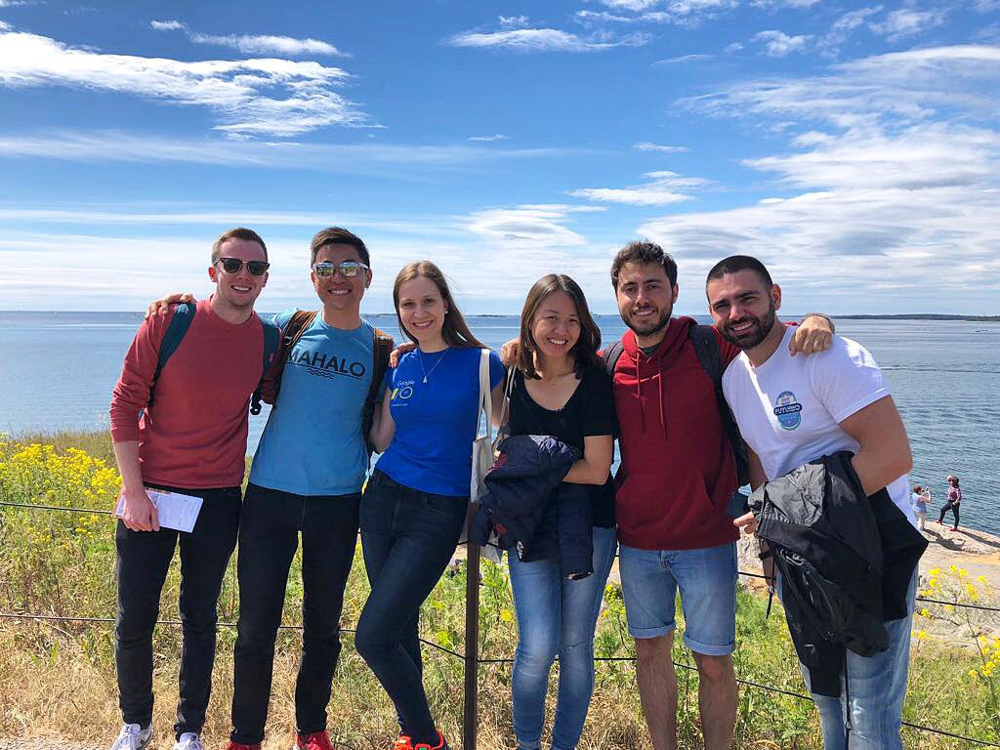
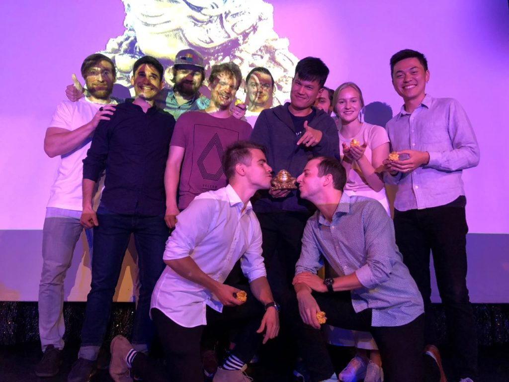
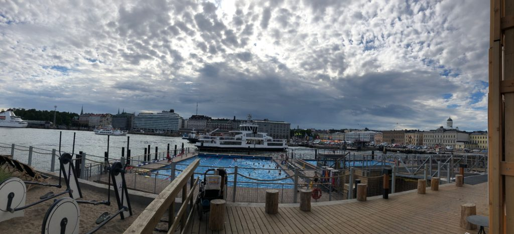
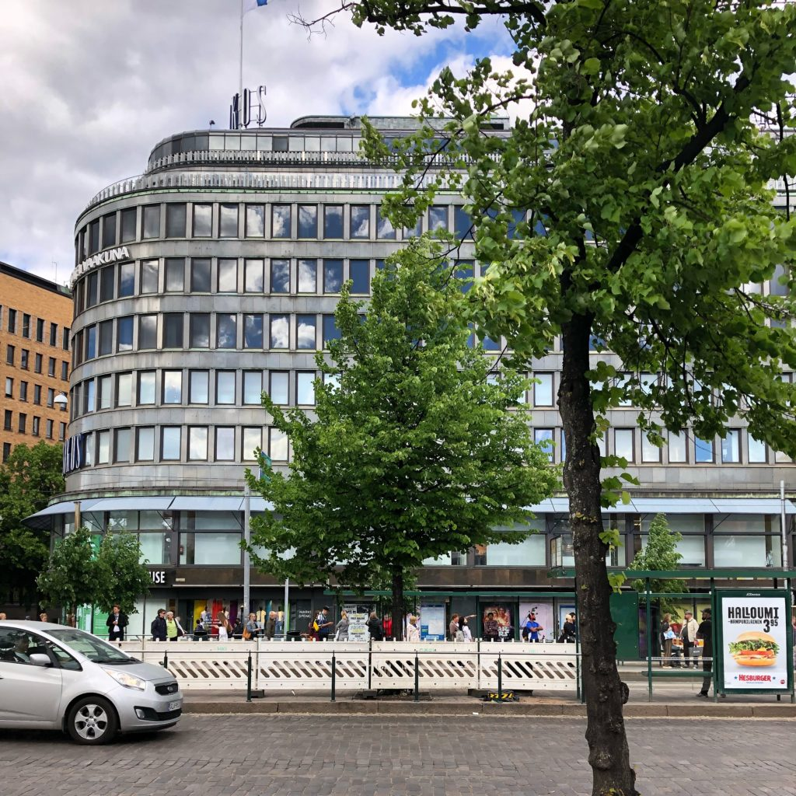
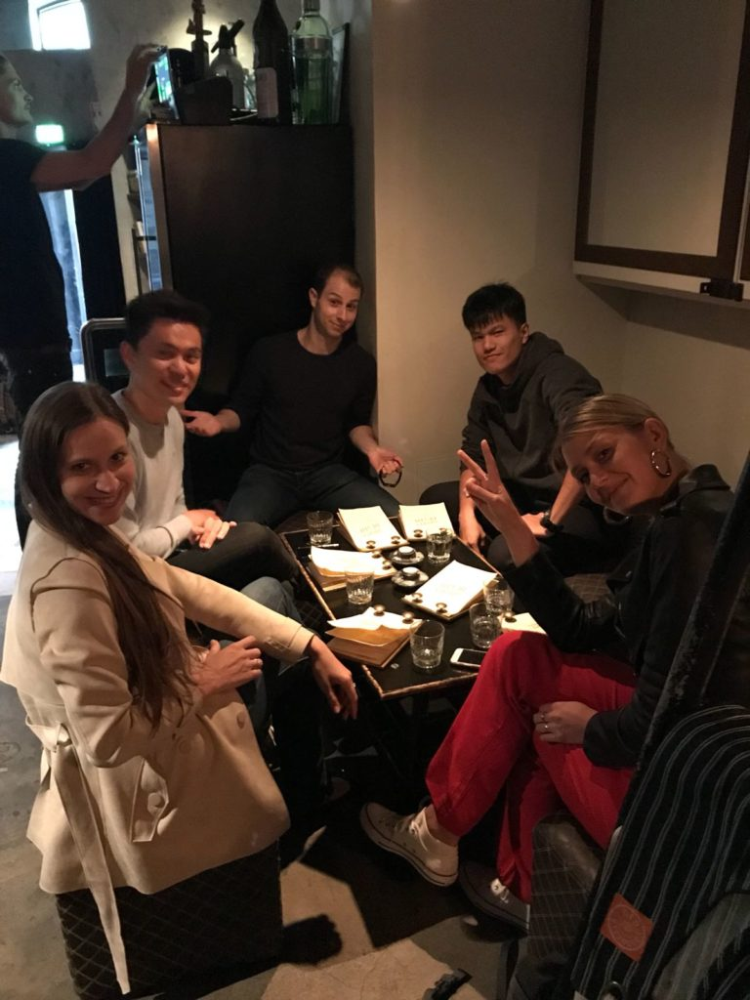

If you've read a few posts on this blog, you'd know that most of them revolve around the topics of technology (technical and non-technical), society and life in general.

Starting today, I'll be focusing a bit more of my time on topics around marketing (Facebook, Google, Pinterest, and other types of _paid_ marketing) because, well, I see it as an important part of my new job!

### My new job at Smartly.io

In June 2018, I started working at [Smartly.io](https://smartly.io), an amazing advertising technology company with an incredibly talented and visionary team. As a fast-growing global company, I believe we're going places. But I've identified that in order for me to contribute in a significant way, I'd need to level-up my knowledge on not just the product but in paid marketing in general. In practice, marketing concepts and the product we've built (and continue to build faster than any competitor) are intertwined, which means the bulk of learning needs to happen now.

To add context to my "why more marketing topics", I'm in the company as a Service Operations Engineer. What that means to me at the moment is that I'll need to be able to troubleshoot and advice many of our existing customers.

If I don't know Facebook advertising concepts and best practices, how would I understand the benefits of our product? And correspondingly, if I don't understand the benefits of our product for our customers (who have been painstakingly nurtured from leads into customers by our Sales Executives and Customer Success Managers), how would I be able to provide excellent customer support, which is consistently being rated as the best thing about our company (ie. our competitive advantage)?

Rhetorical questions aside, I think this is a really exciting time to join the company. Being part of Service Operations means I'll get to directly influence the way we scale our world-class customer support to the next thousands of users. It's clear that we're not going to expand our team linearly with the growth of our user base, so innovation is mandatory. Exciting times ahead for sure!

Ok, enough with the new job and all. What are some marketing topics we might be able to explore together on this blog?

### Some potential marketing topics

Here's a preliminary list of blog post ideas I have currently, which is expected to grow in the next 2-3 months (though I probably won't update it here):

- The only guide you'll need to know 80 percent of Facebook advertising basics
- The single most important but non-obvious thing about advertising on Facebook ([published!](/2018-06-19-the-single-most-important-and-non-obvious-thing-about-advertising-on-facebook/))
- 3 biggest areas of advertising that can be easily automated
- How does Facebook Pixel work?
- 3 most important implications of GDPR law for online advertisers
- Awesome case studies (multiple specific posts)
- ... more

Ok, that's it! Sorry for not publishing any posts for close to two weeks. It's been a helluva ride so far, and I really believe that I'm just getting started. Here are some photos from my past 2 weeks in Helsinki, Finland, learning and socialising every day!

### Photos from my first trip to Helsinki ever

 Touring the fortress on Suomenlinna island near Helsinki with my new colleagues

 And the Golden Frog goes to... team Service Operations! (I'd been officially part of the company for 5 days at that point)

 The view from the beautiful Allas sauna and sea pool - easily one of my favourite places in Helsinki!

 Forum mall, I think?

 Everyone getting ready for the company group photo at the second Futurio 2018!

 Fancy cocktails at Liberty or Death
