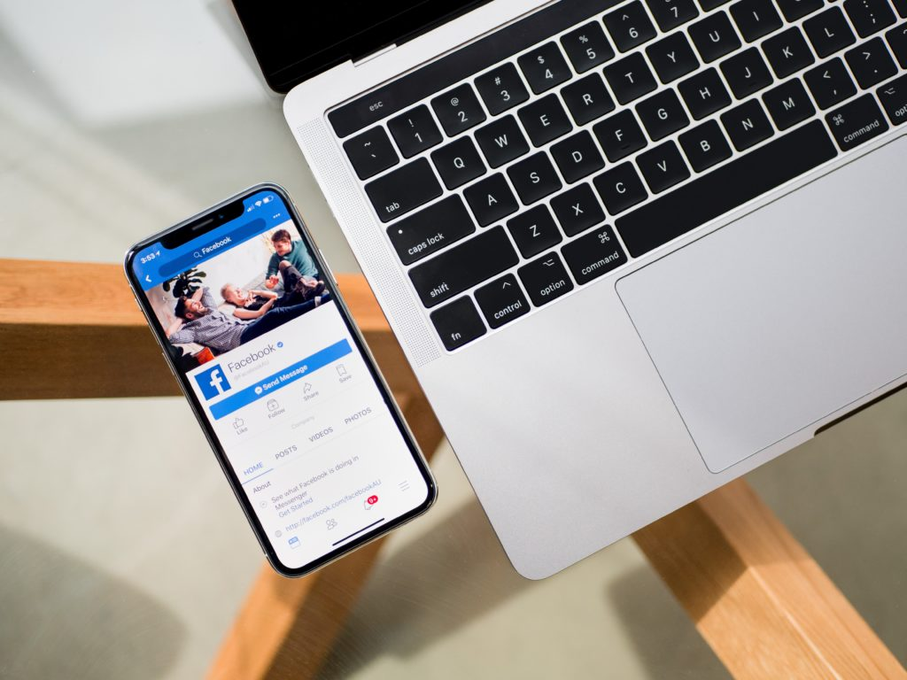

 Photo by Tim Bennett on Unsplash

I'll admit, I have always been a little sceptical when it came to spending money to advertise on Facebook. While it's completely self-explanatory, and with [Cambridge Analytica](https://www.wired.com/story/the-man-who-saw-the-dangers-of-cambridge-analytica/), totally self-evident that Facebook has loads of data on its users individually and in aggregate, I'd always been suspicious of the Ad auction system that Facebook employs.

The part I'm most wary of is the bidding component of the auctioning system. In case you're unfamiliar with the structure of Facebook advertising, here's a quick primer:

- Every opportunity to show an ad to a Facebook user in one of Facebook's many [_placements_](https://www.facebook.com/business/products/ads/how-ads-show) (eg. News Feed) results in an auction
- An **auction** is held in a matter of milliseconds, maybe microseconds, in Facebook's backend to determine whether your ad should be the one to be shown to the current user, or whether another advertiser's ad should be shown instead (side note: I'm also sceptical about whether this actually happens every single time Facebook has a chance to show an ad to someone, since that would probably be in the tens of millions every second)
- To win at an auction, you (as the advertiser) will have to place a bid
- According to [Facebook](https://www.facebook.com/business/help/430291176997542), the ad with the highest sum of 3 values (bid amount, potential action rate, and ad relevance) will win the auction and be shown to the user
- You're only supposed to pay the highest dollar bid required to beat the other advertisers during any auction

Seeing the Facebook owns the entire system and has absolutely no need to expose the _actual_ mechanisms to the public's eyes, **how can an advertiser trust them to do what they say they're doing?** Can we know for sure that I bid $3 and the next guy bid $2, and we both have the exact scores on _potential action rate_ and _ad relevance_, that I'll only need to pay $2.01 instead of $3? (Note: this is a simplified example, please don't chew me up for a technicality.)

Honestly, why wouldn't Facebook charge me a higher amount for each ad shown when it could, seeing that it owns the entire system and can continue in perpetuity to keep it opaque to everyone outside?

Turns out, there is a perfectly logical reason to trust Facebook. Well, at least in this particular case.

You see, there's a very important metric that all marketers will use to evaluate the performance of their advertising campaigns across the online and offline worlds. That metric, [Cost Per Action (CPA)](https://en.wikipedia.org/wiki/Cost_per_action), is the total amount of money spent to obtain a single acquisition. An action here can refer to many things, but it's usually used to refer to something valuable, like a "Add to cart" event for an online store.

So if Facebook decides to charge me more than it actually needed to show an ad in relation to competing bidders, my resultant CPA value will be higher.

A $3 CPA is much, much worse than a $2 CPA. And as a marketer, I'd very likely conclude that Facebook is a horrible place to spend my advertising dollars and I may just pack up and leave for Google and other online advertising platforms.

Put simply, **Facebook would never be able to sustain its advertising business on charging advertisers more than it should**.

Knowing this, we can at least trust that when we set a "bid cap" (max dollar amount I'm willing to pay to show an ad to a user) and choose to let Facebook automatically adjust our bids, we will not be cheated of our money!

* * *

_This is probably the first of many marketing-related posts that are in the [pipeline](/2018-06-16-much-marketing-topics-blog/) (as I'm learning every day at my job at Smartly.io). If you're interested in reading more, consider bookmarking the blog and signing up for the newsletter!_
