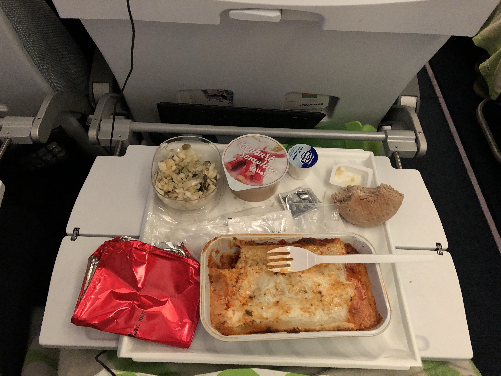

I met a small surprise challenge on my flight home from Helsinki today.

I hadn't asked in advance for vegetarian food. It didn't even occur to me to do that!

In fact, I'm not even sure how one goes about indicating dietary preferences to an airline for "special" meals on flights and what additional costs might be involved. I'll have to ask my vegetarian friends for advice.

The air steward quite nonchalantly told me: sorry, we only have beef lasagna left right now. And he proceeded to place a tray of beef lasagna in front of me. Of all meats, it had to be beef, too. No worries, only one of the biggest animals we frequently eat that takes the most water and energy to rear and butcher inhumanely.

I really didn't see this curveball. I was doing so well this past week, easing myself into the world of clean, vegetarian diets. Now this!

So, as the dead animal sat dead on my tray table, I had one of exactly two choices: eat it, or don't eat it.

_What would it be, Nick?_

My thought process at this point went something like this:

- I'm kinda hungry
- I'd only recently committed to being vegetarian and I'm still learning about the things I have to do to restructure my life around the decision
- Although meat already sounds a bit distasteful to me, I'd rather not pretend to be a freaking saint who has the moral high ground to say "nope, I'm not a meat eater" a week after going vegetarian
- I'll learn from this experience and not let it happen again on future flights
- I need to eat or else I'll starve for the next six or seven hours

_Peels off aluminium foil to expose offending beef lasagna..._

I ate it.

About three hours after eating meat, though, I felt some mild discomfort that I'm sure would have previously gone unnoticed. For one, I noticed how much more plaque had built up on my teeth. I also realised how much thirstier I was compared to after a vegetarian meal. And the most obvious sensation was the heaviness and thickness of I-don't-know-what that I felt in my throat and gut.

At least for me, eating meat makes me _feel_ less healthy. The inflammation that purportedly happens in one's body from consuming meat is palpable to me now. Perhaps an ability I've developed from my week of successful abstinence so far.

Truth be told, I'm actually quite happy to have been presented with this opportunity to learn that my body is starting to prefer not eating meat.

All is well. And you know what? I'm not going to reset my countdown to one month. Three weeks to go!

* * *

_Saturday, 23 June 2018, on an unusually turbulent flight from Helsinki to Singapore._
