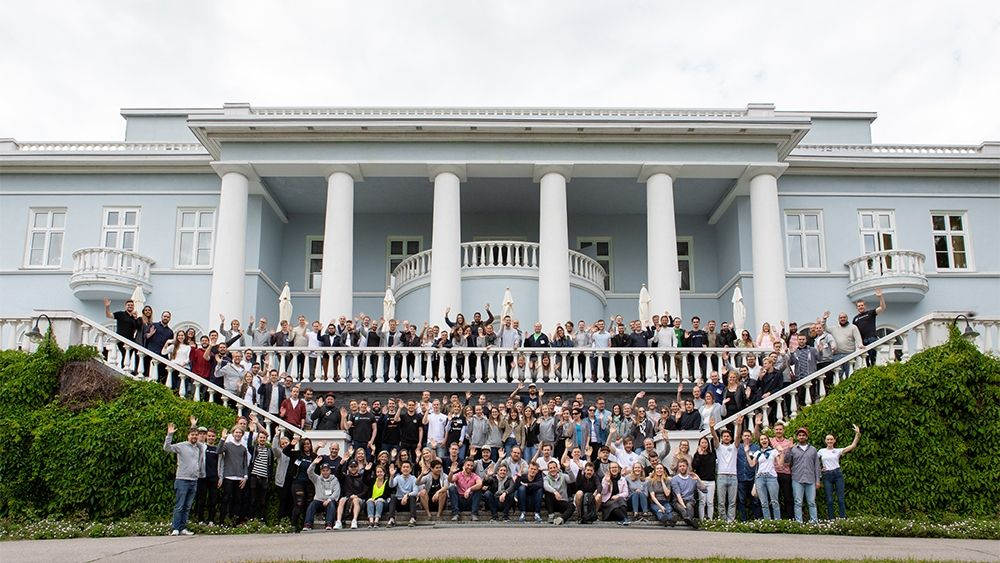
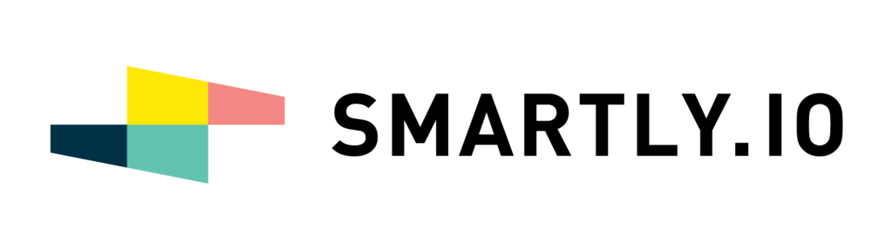

 My most unbelievable first week of work at Futurio 2018 in Haikkoo, Finland

I'm currently working in an organisation that makes me feel valued. The company invests resources and takes risks with me, and in return, I invest what I can in the future of the company. It's really so beautifully simple.

Yesterday marked my first full month at [Smartly.io](https://smartly.io), and I'll be honest, I've just been receiving perks after perks.

I'm talking about material things like state of the art equipment (laptop, headphones, smartphone), a pantry that is always well-stocked with nutritious food and drinks (beers included), and a monthly wellness stipend.

But I'm also talking about the less tangible and arguably more important things like an incredible workplace culture where every person in the team has the right balance of intelligence, humility, and self-motivation. I definitely consider a no-assholes A-team that I can learn from and grow together with to be one of the biggest perks of working at Smartly.

Now that I've been receiving and experiencing the perks, I'm extra pumped to create my best work yet, to help scale the company from facilitating $1 billion annual ads spend to $3 billion, $5 billion, and more.

For the first time in my professional life, I wholeheartedly believe that the company I'm working at can attain their most ambitious goals and come close to fulfilling their vision, which is to "mak\[e\] online advertising easy, effective, and enjoyable."

Time to work smartly to get up to speed with the product, the latest ideas in online advertising, and bring some value back to the company!

* * *

_Saturday, 30 June 2018, at home waiting for a couple of friends to come over for a night of drinks (and possibly partying after)._
